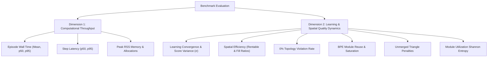

# Comprehensive Benchmarking & Metric Dynamics Guide

`agent_notes/guides/benchmarking_guide.md`

This guide is the authoritative reference for running benchmarks, evaluating performance throughput, measuring reinforcement learning metrics, and analyzing model convergence in the **RL-Discrete-Building-Generator** (Module Lab).

---

## 1. Benchmark Execution Protocols

All benchmarks are executed using `benchmarks/benchmark.py`. The controller executes every test in a fresh, isolated child Python interpreter to eliminate `sys.modules` contamination, memory leaks, and native library state carryover.

### Standard Phase & Subphase Benchmark Protocols

Benchmarks must be executed **after EACH phase and subphase** to evaluate performance deltas and metric dynamics before deciding on node transitions:

1. **Major Phase Verification (50 Episodes)**:
   For major roadmap phases (e.g. Phase 1, Phase 2, Phase 3, Phase 4), execute a **50-episode comparative A/B benchmark** against the prior baseline state:
   ```bash
   python3 benchmarks/benchmark.py \
     --module-dir baseline=/path/to/prior_baseline \
     --module-dir contender=. \
     --episodes 50 \
     --seed 123 \
     --json-out agent_notes/benchmarks/YY-MM-DD_version-eval/comparative_50ep.json \
     --csv-out agent_notes/benchmarks/YY-MM-DD_version-eval/comparative_50ep.csv
   ```

2. **Subphase Verification (25 Episodes)**:
   For subphases (e.g. Phase 1A, Phase 1B, Phase 1C), execute a **25-episode comparative A/B benchmark**:
   ```bash
   python3 benchmarks/benchmark.py \
     --module-dir baseline=/path/to/prior_baseline \
     --module-dir contender=. \
     --episodes 25 \
     --seed 123 \
     --json-out agent_notes/benchmarks/YY-MM-DD_version-eval/comparative_25ep.json \
     --csv-out agent_notes/benchmarks/YY-MM-DD_version-eval/comparative_25ep.csv
   ```

### Key CLI Flags & Options

| Flag | Default | Description |
| :--- | :--- | :--- |
| `--episodes N` | `10` | Number of complete measured episodes per seed (**50 for full phases, 25 for subphases**). |
| `--warmup N` | `0` | Number of unmeasured training episodes to run before benchmarking. |
| `--seed S` | `123` | Deterministic random seed(s). Repeat `--seed` or pass comma-separated list (e.g. `--seed 123,508,808`). |
| `--settings JSON` | `{}` | Custom transactional settings JSON string or file path (`@settings.json`). |
| `--max-steps N` | `2000` | Safety cutoff for total trainer steps per episode. |
| `--episode-timeout S` | `300.0` | Per-episode execution timeout in seconds. |
| `--json-out PATH` | `None` | Output path for structured JSON benchmark report with all episode telemetry. |
| `--csv-out PATH` | `None` | Output path for flattened per-episode CSV dataset. |

---

## 2. What to Measure: Two Core Evaluation Dimensions

Benchmarking is not just about raw CPU time. Every benchmark run must be evaluated across **two distinct dimensions**:



---

### Dimension 1: Computational Throughput & Latency

Measures the speed and resource efficiency of the C geometry kernel, candidate placement generation, and PyTorch Actor-Critic inference:

1. **Episode Wall Time**:
   - `mean`, `p50`, `p95` wall-clock duration to complete a full 4–8 story building layout.
   - **Target Threshold (v0.8.0+)**: $\le 2.0\,\text{s}$ per 4-floor episode ($\le 500\,\text{ms}$ per floor).
2. **Step Latency**:
   - `p50`, `p95` latency per `trainer.step()` invocation across all parallel floor environments.
   - **Target Threshold (v0.8.0+)**: `p50` $\le 60\,\text{ms}$, `p95` $\le 220\,\text{ms}$.
3. **Candidate Evaluations per Step**:
   - Average number of spatial candidate placements evaluated per placement step.
   - Typical range: $4,000 – 8,000$ candidate evaluations per step.
4. **Memory Footprint (Peak RSS)**:
   - Maximum resident set size observed across the benchmark run.
   - **Target Threshold**: $\le 650\,\text{MB}$.

---

### Dimension 2: Learning & Spatial Quality Dynamics

Measures whether the policy is learning, stabilizing, and constructing high-quality architectural buildings:

1. **Episode Score Progression & Variance Reduction ($\sigma$)**:
   - Tracks the aggregate layout reward and raw geometric score over time.
   - **Key Indicator**: Compare quartile standard deviations ($Q_1 \text{ vs } Q_4$). A healthy PPO+GAE training run shows a **$20\% – 40\%$ drop in standard deviation $\sigma$** as the policy converges and suppresses erratic placements.
2. **Rentable Space Ratio**:
   - $\text{Rentable Ratio} = \frac{\text{Rentable Usable Area}}{\text{Total Placed Area}}$.
   - **Target Threshold**: $\ge 85.0\%$ rentable space efficiency across upper stories.
3. **Topology Violation Rate**:
   - Percentage of episodes where core accessibility, stair/elevator shaft reachability, or circulation connectivity failed.
   - **Target Threshold**: **Strictly 0.000%** (Zero reachability or core connectivity failures).
4. **BPE Module Reuse & Bonus Saturation**:
   - Number of high-frequency merged composite modules (`reusedBpeModules`) reused $\ge 2$ times across building floors.
   - `bpeBonus`: BPE reuse bonus points earned (clipped to a maximum of $30.0\,\text{pts}$).
   - **Target Threshold**: $\ge 14$ reused modules, achieving the maximum $30.0\,\text{pts}$ bonus ceiling.
5. **Unmerged Triangle Count & Penalty**:
   - Counts residual unmerged small triangles (`s3`, `s6`, etc.) left over after BPE merging.
   - `unmergedTrianglePenalty`: $-8.0\,\text{pts}$ per average unmerged triangle per floor.
   - **Target Threshold**: $\le 5.0$ unmerged triangles per building layout.
6. **Module Utilization Shannon Entropy**:
   - Evaluates Shannon entropy $H_{\text{norm}}$ over active module dictionary selection frequencies.
   - Measures whether the policy utilizes varied dictionary rooms uniformly rather than degenerating to a single shape.
7. **Action & Layout Hash Diversity**:
   - Measures the number of unique layout configurations generated across episodes to prevent mode collapse.

---

## 3. Metric Analysis & Quartile Breakdown Script

To analyze the generated `benchmark_40ep.json` file across 4 quartiles ($Q_1$: eps 1–10, $Q_2$: eps 11–20, $Q_3$: eps 21–30, $Q_4$: eps 31–40), use the following Python analysis script:

```python
import json
import statistics

def analyze_benchmark(json_path: str) -> None:
    with open(json_path, "r", encoding="utf-8") as f:
        data = json.load(f)

    episodes = data["runs"][0]["episodes"]
    print(f"Total Episodes Analyzed: {len(episodes)}\n")

    def row(name: str, key: str) -> str:
        vals = [float(ep.get(key, 0.0)) for ep in episodes]
        q1, q2, q3, q4 = (
            statistics.mean(vals[:10]),
            statistics.mean(vals[10:20]),
            statistics.mean(vals[20:30]),
            statistics.mean(vals[30:40]),
        )
        q1_sd = statistics.stdev(vals[:10]) if len(vals) >= 10 else 0.0
        q4_sd = statistics.stdev(vals[30:40]) if len(vals) >= 40 else 0.0
        all_mean = statistics.mean(vals)
        all_sd = statistics.stdev(vals)
        return (
            f"{name:<28s} | Q1={q1:7.3f} (±{q1_sd:5.2f}) | Q2={q2:7.3f} | "
            f"Q3={q3:7.3f} | Q4={q4:7.3f} (±{q4_sd:5.2f}) | All={all_mean:7.3f} (±{all_sd:5.2f})"
        )

    print("=" * 115)
    print(f"{'Metric':<28s} | {'Q1 (eps 1-10)':<18s} | {'Q2 (11-20)':<10s} | {'Q3 (21-30)':<10s} | {'Q4 (eps 31-40)':<18s} | {'Overall':<18s}")
    print("=" * 115)
    print(row("Episode Score", "score"))
    print(row("Raw Score", "rawScore"))
    print(row("Rentable Ratio", "rentableRatio"))
    print(row("Topology Violation Rate", "topologyViolationRate"))
    print(row("Reused BPE Modules", "reusedBpeModules"))
    print(row("BPE Bonus Points", "bpeBonus"))
    print(row("Unmerged Triangles", "unmergedTriangles"))
    print(row("Fill Ratio", "fillRatio"))
    print(row("Module Count", "moduleCount"))
    print("=" * 115)

if __name__ == "__main__":
    import sys
    path = sys.argv[1] if len(sys.argv) > 1 else "benchmark_40ep.json"
    analyze_benchmark(path)
```

---

## 4. Documentation & Archiving Protocol

After running a 40-episode benchmark:

1. **Create a Dated Directory**:
   - Create `agent_notes/benchmarks/YY-MM-DD_<version>-<description>/` (e.g. `26-08-14_v0.8.0-phase1-3-eval/`).
2. **Save Benchmark Artifacts**:
   - Save `benchmark_40ep.json` and `episodes_40ep.csv` into that folder.
3. **Write `README.md` Summary**:
   - Include Executive Summary, 4-Quartile Metric Table, and Model Dynamics analysis.
4. **Update Indexes**:
   - Update [`agent_notes/benchmarks/BENCHMARK_SUMMARY.md`](file:///Users/ruslan_faz/Desktop/Work/Thesis/agent_notes/benchmarks/BENCHMARK_SUMMARY.md).
   - Update [`agent_notes/benchmarks/README.md`](file:///Users/ruslan_faz/Desktop/Work/Thesis/agent_notes/benchmarks/README.md).
   - Update [`agent_notes/README.md`](file:///Users/ruslan_faz/Desktop/Work/Thesis/agent_notes/README.md).
