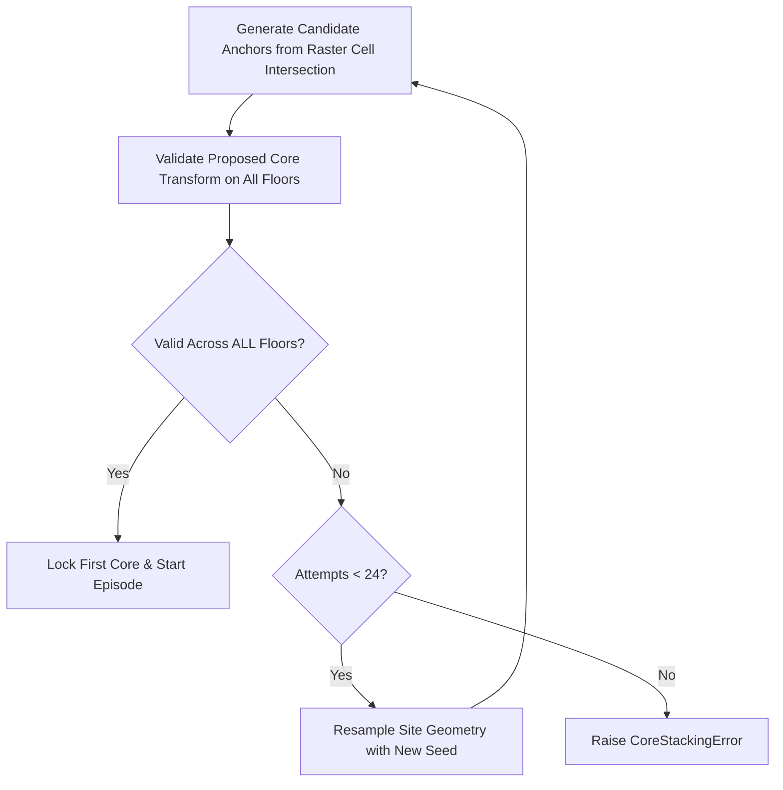

# Multi-Floor Core Shaft Stacking: Developer Guide (`v0.8.0` / `v0.8.1`)

This document provides an architectural reference for the multi-floor vertical core shaft alignment optimizer in **Module Lab v0.8.0** and **v0.8.1**.

---

## 1. Core Stacking Concept & Signature

In a multi-floor building generation episode (4–8 stories), vertical circulation cores (elevators, stairwells, structural service shafts) are building-level actions rather than floor-local actions. 

A legal core stack across $N$ floors requires an exact 4-tuple transform signature:

$$\text{Transform Signature} = (\text{module\_id}, \theta, x_{\text{local}}, y_{\text{local}})$$

where:
- $\text{module\_id}$: The selected core module type (e.g. `"core_3x3"`, `"core_L"`).
- $\theta$: Rotation angle in degrees ($0^\circ, 90^\circ, 180^\circ, 270^\circ$).
- $(x_{\text{local}}, y_{\text{local}})$: Local anchor coordinate within each floor's normalized coordinate system.

World-space canvas offsets are deliberately excluded; exact alignment is validated in each floor's local coordinate frame across all parallel floor environments (`FloorEnvironment`).

---

## 2. Multi-Floor Architecture & Preflight Site Preparation

### Site Preparation Flow
1. **Target Stories**: Primary operating range is 4–8 stories (`parallelEnvironments = 4..8`); the backend supports 1–16 stories for backwards compatibility.
2. **Preflight Core Synthesis**: Before an episode starts, candidate anchors are extracted from the spatial raster intersection common to all floor sites.
3. **Whole-Site Transaction Validation**: Proposed core transforms are checked with SAT polygon containment (`polygon_inside_site_c`), wall clearance, and core spacing predicates.
4. **Site Resampling**: If no valid transform exists across all floors, the entire floor group is discarded and regenerated with a new attempt seed (up to 24 transactions). Individual floors are never swapped or arbitrarily expanded.

---

## 3. Policy Action Decision & Action Space Pooling

Once the mandatory initial core is locked across all floors, subsequent core placements use a building-level decision gate:

- **Option A**: Select a valid shared building-level core stack transform.
- **Option B**: Choose the **building-level no-stack gate** to close core placement and proceed to floor-local room placement actions.

### Action Pooling & Log-Probability
* Shared core candidates are removed from floor-local action lists.
* When the policy chooses a building-level core stack, feature rows from all floors are pooled into **one categorical log-probability term** (`decisionScope: "building"`, `logProbTerms: 1`). The action probability is not duplicated per floor.

---

## 4. Atomic Multi-Floor Commit & Checkpoint Rollback

Core placement operations use atomic transaction checkpoints across all parallel floor environments:

1. **Re-validation**: Transform signatures are verified immediately prior to state mutation.
2. **Checkpoint Creation**: Each floor captures a lightweight state snapshot (placement indexes, cell occupation bitmaps, attachment frontiers, core IDs, and scalar area counters).
3. **Atomic Execution**: If any floor raises an exception during core placement, all floors are immediately restored from their checkpoints without appending state mutations or policy log-probabilities.

---

## 5. WebSocket Telemetry & Protocol Fields

Every WebSocket state payload (`site`, `placements`, `evaluation`, `episodeDone`) includes a `coreStacking` metadata dict containing:

| Field | Type | Description |
|---|---|---|
| `enabled` | `bool` | `true` if multi-floor core stacking is active (`parallelEnvironments > 1`). |
| `status` | `string` | `"active"`, `"locked"`, or `"disabled-single-floor"`. |
| `lockedCoreCount` | `int` | Number of building-wide locked core shafts. |
| `exactLocalAlignment` | `bool` | `true` when all floors share exact local anchor coordinates. |
| `stacks` | `list[dict]` | Transform parameters (`module`, `rotation`, `localAnchor`, `floorIds`, `logProbTerms: 1`). |

---

## 6. Codebase File References

* **`server.py`**:
  * `FloorEnvironment`: Manages multi-floor state, atomic checkpoints, and candidate action space.
  * `_prepare_site()`: Executes site resampling and preflight whole-site core transactions.
* **`fast_geometry.c`**:
  * `polygons_overlap_c()` and `polygon_inside_site_c()`: Accelerated C routines for multi-floor core overlap and site containment checks.
* **`geometry.py`**:
  * `_LazyRotationDict`: Generates rotated polygon representations on-demand.
