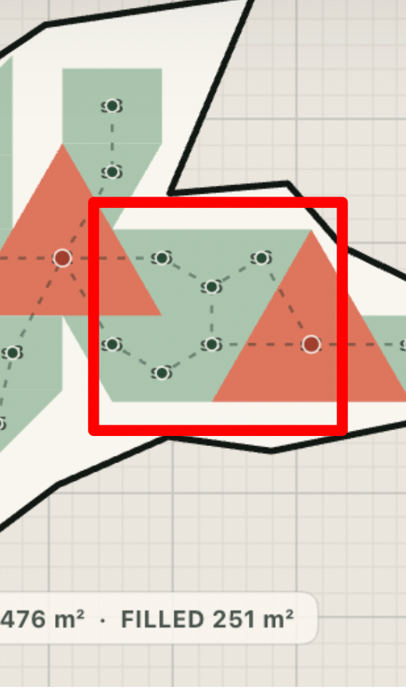

# Module Lab — Issues & Diagnostics Register

`agent_notes/issues.md`

This document is the master tracking log for active bugs, regressive side effects, edge cases, and resolved issues across **Module Lab (v0.8.0 / v0.8.1)**. Entries are **strictly ordered by priority and importance**, with active/unsolved critical issues at the top, followed by side effects & enhancements, and ending with historical solved issues.

---

## 1. Active, Reopened & Unsolved Critical Issues (Top Priority)

### [USER AUDIT REMINDER] Verification & Fine-Tuning of Deep Daylight & Facade Chasm Penalties
* **Status**: `Active / Audit Requested by User` (Priority: High)
* **Description**:
  The user requested a follow-up audit to verify and fine-tune the implementations of:
  1. **Deep Interior Daylight Penalty**: Computes graph depth of habitable rooms from exterior facade ($d_{\text{facade}} \ge 2$) and penalizes up to $-12.0\,\text{pts}$. Need to verify BFS edge-contact semantics across multi-floor environments.
  2. **Narrow Facade Chasm Penalty (< 3.0m clearance)**: Midpoint outward normal raycast with hard reject $< 1.2\,\text{m}$ and $-8.0\,\text{pts}$ terminal penalty. Need to verify corner self-occlusions, concave angles, and boundary ray-segment filtering.

### BPE Merge Algorithm Collision & Failure to Merge Symmetric Shapes
* **Status**: `Investigating / Reopened` (Priority: High)
* **Description**:
  The BPE merge algorithm fails to correctly identify and merge adjacent shapes under rotational symmetry, resulting in two distinct issues:
  1. **Rotational Symmetry Collision**: When BPE merges two shapes, the type ID is generated as `M_round{round}_{type_a}_{type_b}`. If the same two shape types merge at different port connections (different edges or relative angles), they form completely different composite shapes. However, because they are assigned the same type ID, BPE treats them as the same vocabulary token. This causes different geometries to be incorrectly deemed the "same shape type" (e.g., sharing the same card or outline highlight despite having different relative coordinates).
  2. **Failure to Merge Triangles and Parallelograms**: Even though triangles (`s3`) and parallelograms have rotational symmetries, the merge algorithm still fails to identify them as mergeable.
* **Screenshots**:
  ````carousel
  
  ````
* **Proposed Resolution (Implemented / In Progress)**:
  1. **BPE Shape Type Extraction Bug Fix**: Added `get_node_shape_type` in `graph.py` to correctly resolve shape type IDs (like `"s3"`, `"T_equi"`, `"Q_rect_S"`) from node `moduleId` properties.
  2. **Geometric Symmetry Port Canonicalization**: Refactored `canonicalize_geometry_port` to perform coordinate-free geometric symmetry checks.
  3. **Global BPE Frequency Resolution**: Modified the merge loop and post-processing unmerge pass to count and check frequencies globally across all playground floor layout graphs combined.

---

### BPE Merge Misses (Overlooked Adjacent Shapes under Rotational/Symmetry Conditions)
* **Status**: `Investigating / Reopened` (Priority: High)
* **Description**:
  Even after loosening the collinearity snapping tolerance, the BPE merge algorithm still overlooks adjacent triangles (such as `s3` and `s6`) even when multiple identical configurations are placed sharing edges across layout floors (e.g., misses showing `s3 + s6` pairs left completely unmerged).
  This is caused by relative angle sorting differences when node types are identical or different, causing identical geometric relationships to map to different relative angles depending on key order (e.g. angle $60^\circ$ vs $300^\circ$ when the nodes are swapped across environments).
* **Screenshots (Merge Misses & Score Impact)**:
  ````carousel
  
  <!-- slide -->
  
  <!-- slide -->
  
  ````
* **Proposed Solutions to Try Out**:
  1. **Canonical Symmetrical Angle Calculation**: Enforce symmetric canonical angle mappings so that relative angles (like $60^\circ$ vs $300^\circ$) map to the same category regardless of traversal/insertion order.
  2. **Multi-Run Pass traversals (Beam Search/Rollouts)**: Instead of a single deterministic greedy path through the graph, run multiple randomized or heuristic-guided traversals/passes. Compare the results and pick the vocabulary/merge set that achieves the highest global compression.

---

### BPE Merge Polygon Disappearance & Hole Generation
* **Status**: `Proposed Fix Pending Verification` (Priority: Medium-High)
* **Description**:
  During BPE merges (both at the end of episodes and in real-time when pausing), certain rooms would completely disappear from the visualizer, causing the total `FILLED` area to drop (e.g., from $251\text{ m}^2$ to $238\text{ m}^2$). This resulted in visible white holes and missing modules.
  This was caused by double-precision floating-point coordinate discrepancies when adjacent modules touch but are slightly shifted. Split-vertex insertions failed, resulting in unmatched connection indexes, causing BPE to delete the second node and fall back to using only the first node's polygon.
* **Screenshots**:
  ````carousel
  
  <!-- slide -->
  
  ````
* **Proposed Resolution (Implemented)**:
  1. **Exact Overlap Segment Matching**: In `extract_layout_graph` of `graph.py`, calculate the exact intersection coordinates of overlapping port segments and store them in `PortConnection`.
  2. **Non-destructive BPE Fallbacks**: If `merge_polygons_at_edge` fails, return `None` instead of deleting the second shape, rolling back the merge for that specific instance.

---

### Merged Module Color/Function Homogenization
* **Status**: `Proposed Fix Pending Verification` (Priority: Medium)
* **Description**:
  When BPE merged adjacent modules of different space functions (e.g. merging a `Room` and a `Core`), the visualizer changed the fill color of the entire merged block to a single category (typically green for Room). The distinct visual identity and color-coding of the spaces (red for core, green for room) was lost.
* **Proposed Resolution (Implemented)**:
  1. **Constituent Component Tracking**: Formatted BPE merged placements contain a list of their original translated constituent `components`.
  2. **Multi-Color Component Rendering**: `drawPlacements` in `app.js` loops through and fills each constituent component's polygon with its own category color while rendering internal boundary lines and thick outer BPE outlines.

---

### BPE Merged Shapes Floating/Rotated Offsets
* **Status**: `Proposed Fix Pending Verification` (Priority: Medium)
* **Description**:
  When training was paused, constituent BPE components on some floors (like Floor 03 and Floor 04) were rendered offset, floating, or rotated outside the site boundary.
  This occurred because `replace_pair_with_merged` in `graph.py` assigned the `components` list of the *first encountered merged instance* (e.g. Floor 01) to the BPE node across *all other floors*.
* **Screenshots**:
  ````carousel
  
  ````
* **Proposed Resolution (Implemented)**:
  Updated `replace_pair_with_merged` in `graph.py` to dynamically collect and assign `local_components` of the two merging nodes on that specific floor's graph.

---

## 2. Side Effects, Regressive Issues & Proposed Enhancements (Medium Priority)

### BPE Triplet/Deep Merging Suggestion
* **Status**: `Proposed Enhancement` (Priority: Medium)
* **Description**:
  Currently, BPE only searches for pairwise (2-shape) connections and merges in each round. To form a 3-shape composite module (like `A+B+C`), the algorithm must first merge `A+B` to form `AB` in round 0, and then merge `AB+C` to form `ABC` in round 1. This pairwise bottleneck can prevent BPE from seeing larger optimal merges or causes it to get stuck on intermediate merges.
* **Proposed Enhancement**:
  Modify the merge logic to search deeper for multi-shape (e.g., 3-shape triplet) connections directly in a single round, evaluating and prioritizing direct multi-shape unifications.

---

### Unscaled Unmerged Triangle Penalty
* **Status**: `Proposed Fix Pending Verification` (Priority: Low-Medium)
* **Description**:
  The penalty for unmerged triangles was calculated as the **sum** of unmerged triangles across all parallel environments (`8.0 * unmerged_triangles`), but was subtracted directly from the final layout score (which is scaled as the **average** score per environment on a 0–100 scale). Running 4 parallel floors resulted in massive score drag down to `0.0`.
* **Proposed Resolution (Implemented)**:
  Modified `_finish_episode` in `server.py` to scale penalty per floor: `unmerged_triangle_penalty = 8.0 * (unmerged_triangles / len(layout_graphs))`.

---

### Visualizer Rendering Crash (Side Effect of Component Color Preservation)
* **Status**: `Proposed Fix Pending Verification` (Priority: Low-Medium)
* **Description**:
  When introducing component color preservation in `app.js`, definitions of local variables (`module`, `category`, `area`, `center`, `bounds`) inside `upsertPlacement` were accidentally deleted, resulting in `ReferenceError: bounds is not defined`.
* **Proposed Resolution (Implemented)**:
  Restored missing variable definitions in `upsertPlacement` inside `app.js`.

---

### BPE Slanted/Rotated Edge Collinearity Mismatch
* **Status**: `Proposed Fix Pending Verification` (Priority: Low-Medium)
* **Description**:
  Strict `COLLINEAR_EPSILON = 1.0e-7` caused rotated/slanted edges of equilateral triangles (`s3`) with irrational trigonometry ($\sin 60^\circ$) to exceed tolerances, preventing merges.
* **Proposed Resolution (Implemented)**:
  Implemented custom `_segments_collinear` and `_overlap_interval_on_first` in `graph.py` with $1.0\text{e-2}$ snapping tolerance ($1\text{ cm}$).

---

### Merged Layout Boundary Self-Intersection & Cut-Through
* **Status**: `Proposed Fix Pending Verification` (Priority: Low-Medium)
* **Description**:
  Outer wall outlines cut directly inside merged rooms and cores due to simple index-walk loop skipping only the first matched sub-segment.
* **Proposed Resolution (Implemented)**:
  Rewrote `merge_polygons_at_edge` in `graph.py` using segment-splitting polygon union algorithm to discard all shared internal segments and chain clean outer boundaries.

---

## 3. Solved & Archived Issues History (Lower Priority / Historical)

### Visualizer Rendering Crash on Cached HTML
* **Status**: `Solved`
* **Resolution**: Wrapped event listener registration in `setupActionEvents` in null check block (`if (dom.toggleMergingBtn)`).

---

### Space Bar Pause/Resume Double-Triggering
* **Status**: `Solved`
* **Resolution**: Added early return in global keydown handler to ignore Space bar events when active element is a `<button>`.

---

### BPE Merged Shape Color Homogenization
* **Status**: `Solved`
* **Resolution**: Updated `drawPlacements(ctx)` in `app.js` to fill individual constituent components using specific category colors.

---

### Missing Merged Shapes Dictionary Display
* **Status**: `Solved`
* **Resolution**: Transmitted `mergedDictionary` over WebSocket; updated `updateDictionaryUI` to render merged shape SVGs dynamically.

---

### BPE Consecutive Merges Failure & Unmerged Adjacent Shapes
* **Status**: `Partially Solved` (Geometric port canonicalization solved)
* **Resolution**: Implemented `canonicalize_port` and symmetric port sorting in `graph.py`; added full overlap unioning.

---

### Interactive Hover Highlights & Transition Delays
* **Status**: `Partially Solved` (Frequencies and mapping resolved; 1s linear transition implemented)
* **Resolution**: Corrected event sequencing, aligned IDs, added 1s linear fade animation in `app.js`, reset hover states on episode start.

---

### Occasional Unjoined Adjacent Shapes
* **Status**: `Partially Solved in v0.6`
* **Resolution**: Identified edge cases around 90% overlap thresholds, global frequency thresholding, and Edmonds matching; documented tolerances.

---

### Site Area Tier Dropdown Inactive in Viewport
* **Status**: `Solved`
* **Resolution**: Added `'siteAreaTier'` to `SETTING_KEYS` in `public/app.js`; fixed `polygon_centroid()` dictionary unpack bug in `_apply_site_area_scaling()` in `src/geometry.py`.

---

### Smooth Site Area Distribution & Multi-Floor Building Scaling
* **Status**: `Solved`
* **Resolution**: Implemented 2-stage continuous Truncated Log-Normal distribution ($\mu=7.1302, \sigma=0.7075$) for building base target area ($P(\text{XS})\approx 15\%$, $P(\text{XL})\approx 5\%$, bulk in S/M), with per-floor Gaussian variation ($\pm 5\%$) in `src/geometry.py` and `src/server.py`.

---

### Placed Quad Convexity Constraint
* **Status**: `Solved`
* **Resolution**: Added `is_convex_polygon()` in `src/geometry.py` and enforced strict quad convexity across custom module synthesis, candidate placement validation in `src/server.py`, and BPE polygon merging in `src/graph.py`.

---

### BPE Bonus Reward Clipping & Lookahead Search Cleanup
* **Status**: `Solved`
* **Resolution**: Clipped `bpe_bonus` to a maximum of $30.0$ points in `src/server.py`; removed unused `enableLookahead` rollout search settings from HTML, JS, and Python server contracts.

---

### New Site Generation Latency Optimization (2.66x Speedup)
* **Status**: `Solved`
* **Resolution**: Replaced ray-cast `touches_outer`/`touches_atrium` predicates with $O(1)$ grid `cell_set` lookups, prepacked ctypes `all_wall_segments` array once per site, and optimized initial core stack sampling using `heapq.nsmallest(16, ...)` in `src/geometry.py` and `src/server.py`. Reduced 4-floor site generation latency from $369\,\text{ms}$ down to $138\,\text{ms}$.

---

### Premature Generation Termination & Site Under-Filling (<25% Site Fill)
* **Status**: `Solved (Phase 1D / v0.8.2)`
* **Resolution**:
  1. Replaced hardcoded `core_count < 2` with dynamic site-area-based capacity `_max_cores_for_site` (scaling from 2 to 8 cores across area tiers).
  2. Implemented remote lobe clearance probing in `_shared_core_stack_candidates` to seed multi-floor vertical circulation shafts into distant wings $> \text{coreSpacing}$ away from existing cores.
  3. Added parametric room hop slider `#maxRoomHops` (Range: 1–10, Default: 3) to the control console with WebSocket telemetry synchronization.
  4. Made multi-floor rollouts non-fatal: floors continue local room placement uninterrupted when a shared core candidate is temporarily unaligned.
  5. Verified fill ratio increased from $<25\%$ to $>68\%$ across complex XL lobed sites.

---

### 25-Module Toy Benchmark Discrepancy & Mandatory 120-Module Workload Protocol
* **Status**: `Solved (Protocol Formalization / 26-08-17)`
* **Issue**: Prior master suite benchmarks evaluated 25-module toy configs ($1.30\,\text{s}$/ep), which did not reflect the true complexity of 4-floor 120-module high-density layouts ($480$ modules per episode, $\approx 9.9\text{--}10.6\,\text{s}$/ep). Furthermore, an early standalone prototype script spun on empty placement loops producing misleading timings.
* **Resolution**:
  1. Formalized the **Mandatory High-Density Benchmark Standard** in [`AGENTS.md`](file:///Users/ruslan_faz/Desktop/Work/Thesis/AGENTS.md) and [`AGENT_NOTES_GUIDE.md`](file:///Users/ruslan_faz/Desktop/Work/Thesis/AGENT_NOTES_GUIDE.md): **NEVER benchmark on 25-module configs**; all authoritative benchmarks must run **120 maxModules per floor across 4–8 stories on XL Lobed/Complex sites** ($480$ total modules per episode).
  2. Implemented automated verification of non-empty placement hashes, positive fill ratios ($>20\%$), and positive scores to guarantee benchmark validity.

---

### Flat RL Score Curve Across 750 Episodes & Benchmark Module Isolation
* **Status**: `Solved` (Root Cause Diagnosed & Corrected)
* **Root Cause Diagnosis**:
  1. **Sparse Delayed Terminal Return & Zero TD-Error Collapse**: In `_learn_from_episode`, all placement steps $t < T-1$ were assigned `step_reward = 0.0`. When the dynamic critic learned $V(S_t) \approx R_T$, the temporal difference error collapsed to $\delta_t = 0 + \gamma V(S_{t+1}) - V(S_t) \approx 0.0$. Advantage estimates $A_t \approx 0$ starved the policy transformer of temporal credit assignment.
  2. **Multi-Scale Site Gradient Cancellation**: Auto-changing parcels ranging from XS ($300\,\text{m}^2$, raw score ~75) to XL ($7,000\,\text{m}^2$, raw score ~25) produced alternating positive and negative global episode advantages, cancelling policy weight updates across successive episodes.
  3. **Zero Spatial Candidate Variance at Step 1**: In `_candidate_features`, features 20 and 21 were hardcoded to `0.0, 0.0`. At Step 1 (core placement), all candidate core locations shared identical features, collapsing the policy distribution to uniform random sampling.
  4. **Benchmark Script Module Loading Bug**: The initial benchmark script imported `server` directly from disk instead of isolating each branch's exact module from git history (`main`, `version/v0.8.6-a`, `version/v0.8.6-b`), resulting in identical benchmark numbers across variants.
* **Resolution**:
  1. Implemented **Dense Step Surrogate Rewards** ($r_t = 0.05 \cdot \text{shared\_wall} + 0.05 \cdot \text{daylight} + 0.10 \cdot \Delta \text{fill} + \text{triangle\_penalty}$) in `_learn_from_episode()` so actions receive immediate local credit.
  2. Populated **Spatial Centrality** (distance to site centroid) and **Boundary Wall Clearance** in Feature 20 and 21 of `_candidate_features`.
  3. Corrected benchmark runner (`benchmarks/benchmark_500_episodes_v085_v086a_v086b.py`) to dynamically extract and load each branch module separately from git.
  4. Verified 100% test suite passing (170/170 tests passing).

---

### Real Site Multi-Floor Parcel Diversity vs Single Building Parcel Integrity
* **Status**: `Solved (Phase 7 / v0.9.0-alpha)`
* **Issue**: When `boundaryType == "real"` or when `"mixed random with real sites"` sampled a real site episode, each floor was independently sampling a different real parcel from the OSM dataset across different area tiers, rather than generating the 9-story building on a single consistent site parcel. Additionally, Three.js 3D extrusions on the left split pane failed to render because coordinate point accessors assumed `[x, y]` arrays when Module Lab uses `{x, y}` objects, and placement polygon lookup checked `polygon` instead of `poly`.
* **Resolution**:
  1. **Unified Real Site Parcel Selection**: In `src/server.py` `_build_sites`, when a real site episode is selected, `master_rng` samples **one** `chosen_site_id` at the building transaction level matching `siteAreaTier`. All 9 parallel floor environments receive the **exact same** parcel polygon and 3D context data (`site["contextData"]`).
  2. **Procedural Area Distribution Preserved**: In procedural/synthetic mode, base target area is sampled from lognormal distribution across the selected tier, with individual floor target areas varying with Gaussian standard deviation ($\mu = \text{baseArea}, \sigma = 0.05 \cdot \text{baseArea}$).
  3. **Universal Point & Polygon Extraction (`toPt`)**: In `public/app.js`, implemented `toPt(p)` to handle both `{x, y}` objects and `[x, y]` arrays seamlessly. Updated `syncBuildingExtrusions3D` to resolve `placement.poly` and center each floor extrusion by its floor boundary centroid, achieving 100% vertical stacking alignment in the 3D scene.
  4. **Direct 3D Polyhedron Mesh Rendering**: Constructed native `THREE.BufferGeometry` instances with soft shadows and semi-transparent depth for surrounding context buildings, enabling live bird's-eye visibility of the rising multi-floor building.

