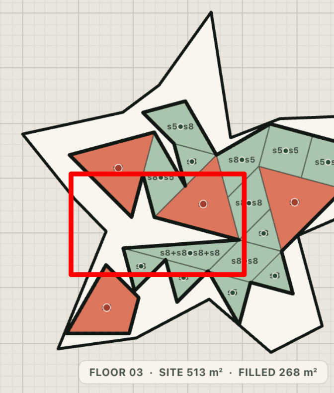

# Module Lab v0.6-A - Issues Tracker

This document tracks all layout, geometric, and RL training issues. Solved issues remain logged for future reference.

## v0.6-A Path 1 Verification Update

The five Path 1 geometry issues below are resolved in this folder and protected by collected `unittest` regressions:

- **Rotational collision**: merged IDs use a deterministic rotation-only, reflection-sensitive pair geometry signature that includes the attachment position.
- **Symmetry misses**: the signature is independent of node order and raw 60°/300° traversal direction; a deterministic polynomial Edmonds blossom matcher counts maximum node-disjoint global occurrences.
- **Disappearing polygons / accidental holes**: replacements are transactional and component-preserving. Only corresponding shared-wall endpoints may snap. A small positive gap may close within a measured shared-length × separation budget, but negative filled-area deltas beyond tight numeric epsilon always fail locally or roll back globally. Unsupported multi-ring unions fail without mutation.
- **Slanted collinearity**: wall ports and full edges share scale-aware 1 cm linear / 0.057° angular predicates and measure the inclusive 90% threshold conservatively in both segment frames.
- **Boundary self-intersection**: the union must consume one complete exposed loop and pass `geometry.is_simple_polygon`; every coincident internal subsegment is cancelled.
- **Episode dictionary handoff**: `episodeDone.dictionary` remains the completed palette used by its placements, while `nextDictionary` is held by the client until `beginNextEpisode`.
- **Root constraint semantics**: server and paired HTML controls enforce 1–9 m edges and 3–8 vertices; the fixed triangle/quad catalog filters actual edge lengths and rejects infeasible settings atomically.
- **Canonical single-floor mode**: dictionaries and first placements are Room-only, with Core/Corridor classifications and core-dependent topology scoring disabled.
- **Triangle reward contract**: terminal and read-only evaluation paths share the exact `8.0 × average post-BPE triangle count per floor` penalty.
- **BPE reuse reward contract**: final merged-token occurrences are counted globally; every occurrence whose token frequency is at least two earns exactly `+3.0`, without topology, floor-count, or component-depth scaling.

Run `python3 -m unittest discover -s tests -v` to exercise these cases. The BPE test classes now inherit from `unittest.TestCase`, fixing the v0.5.1 harness gap that previously collected zero BPE tests with this command.

The detailed entries below retain the v0.5.1 investigation history. Where an older status or proposed resolution conflicts with this verification update, the v0.6-A update above is authoritative.

---

## 1. Solved Issues


### Visualizer Rendering Crash on Cached HTML (HTML Cache Mismatch)
* **Status**: `Solved`
* **Description**:
  When the browser served a cached `index.html` (which lacked the new merging toggle button) along with the updated `app.js` (which registered an event listener on it), the script would encounter a `null` DOM reference and throw a `TypeError: Cannot read properties of null (reading 'addEventListener')`. This halted the entire JavaScript execution thread.
* **Resolution**:
  Wrapped the event listener registration in `setupActionEvents` in a null check block (`if (dom.toggleMergingBtn)`). This stops the TypeError crash and allows the script to initialize successfully even in the presence of browser cache mismatch.

---

### Space Bar Pause/Resume Double-Triggering
* **Status**: `Solved`
* **Description**:
  When the user paused or resumed training using the Space bar while a button (such as the Pause button itself) had keyboard focus, the browser fired its default Space-to-Click event in addition to the global keydown event. This caused `toggleTraining()` to be called twice in rapid succession, immediately undoing the action.
* **Resolution**:
  Added an early return in the global keydown handler to ignore Space bar events if the active element is a `<button>`, allowing the browser's default click handler to manage the event naturally without double-triggering.

---

### BPE Merged Shape Color Homogenization (Core Turning into Room After Merging)
* **Status**: `Solved`
* **Description**:
  When BPE merged adjacent modules of different categories (e.g., merging a `Core` and a `Room`), the client filled the entire merged shape contour with a single category color (typically green/room color), completely losing the distinct color-coded visual identity of the constituent spaces (red for core, green for room).
  
* **Screenshots**:
  ````carousel
  
  <!-- slide -->
  
  ````

* **Resolution**:
  Modified `drawPlacements(ctx)` in `app.js` to always fill and draw individual constituent components using their own specific category colors if `placement.components` is present. Because the wall cache handles removing interior walls when merging is active, the shapes look unified but preserve their distinct interior functions.

---

### Missing Merged Shapes Dictionary Display
* **Status**: `Solved`
* **Description**:
  When merging was enabled, the visualizer sidebar still rendered the basic unmerged shapes library in the dictionary panel. The BPE-merged composite shapes (like L-shapes or T-shapes) were not shown in the dictionary list, making it impossible to see the SVG geometries of BPE-merged modules.
* **Resolution**:
  Updated the websocket payload (in both `placements` and `episodeDone` events) in `server.py` to transmit the active BPE merged vocabulary (`mergedDictionary`). Updated `app.js` to store this dictionary and modified `updateDictionaryUI` to render the merged shape SVGs dynamically when merging is enabled (default), falling back to the base shapes list when merging is disabled (via key/button M).

---

### BPE Consecutive Merges Failure & Unmerged Adjacent Shapes (Edge-Index & Port Shift Mismatch)
* **Status**: `Solved in v0.6-A` (canonical geometry keys, disjoint frequency, transactional chaining)
* **Description**:
  Even though shapes could be merged into larger sequences (such as multiple adjacent room triangles, or a merged `s3+s3` quadrilateral and a neighboring `s3` triangle), BPE would fail to detect the merge opportunity on some floors. This resulted in duplicate labels and thick outlines between touching shapes that should have been unified.
  
  This was caused by two main bugs:
  1. **Port Index Shift**: The connection port keys used `edge_index` of the merged polygon. Since BPE walks merged polygons dynamically, the edge order on a merged shape shifts across BPE rounds and environments. This caused BPE to count identical connections as different pairs, splitting their frequencies and preventing merges from hitting the `min_frequency = 2` threshold.
  2. **Short Port Overlap Segments**: Merging was performed on the port segment (which is only half of the shared edge). This left the other half of the shared edge in the merged polygon, creating self-intersecting loops and collinear artifacts that broke subsequent adjacency detection.

* **Screenshots**:
  ````carousel
  
  <!-- slide -->
  
  <!-- slide -->
  
  ````

* **Resolution (Verified in v0.6-A)**:
  1. **Coordinate-free pair identity**: A rotation-only, reflection-sensitive geometry signature includes both polygons and their along-edge attachment, eliminating traversal-order and port-index collisions.
  2. **Exact global occurrence selection**: A deterministic polynomial Edmonds blossom matcher selects the maximum node-disjoint occurrences for each candidate across floors.
  3. **Transactional full-boundary union**: All mutual collinear intervals are split and internal segments cancelled; a replacement commits only when it preserves every component and produces one simple, area-safe outer loop.
  4. **Global singleton rollback**: Final merged-token frequency is evaluated across the complete multi-floor episode, and a token with global frequency below two is expanded back to its components.
  5. **Canonical reuse bonus**: Every final occurrence of a globally reused merged token earns exactly `+3.0`, independent of topology validity, floor count, or component depth.
  6. **Stable protocol identity**: The merged vocabulary and placements publish the same collision-free token IDs for cards, hover matching, and score accounting.

---

### Occasional Unjoined Adjacent Shapes Despite Matching Dictionary Combinations
* **Status**: `Partially Solved in v0.6`
* **Description**:
  While the BPE merging pipeline is significantly stabilized in the v0.6 iterations compared to v0.5.1, occasional instances of unjoined adjacent shapes still appear on the canvas even when the exact composite combination already exists in the shape vocabulary.
* **Analysis**:
  This occurs when:
  1. **Near-Threshold Overlap / Angular Drift**: Floating-point precision shifts along slanted/rotated edges fall just below the strict 90% collinear overlap threshold or 1 cm / 0.057° tolerances.
  2. **Frequency Thresholding (`min_frequency = 2`)**: If a candidate pair appears only once across environments and fails to meet the global minimum frequency in a round, it is skipped and remains unmerged for that episode.
  3. **Node-Disjoint Edmonds Matching**: When multiple overlapping merge opportunities exist, Edmonds blossom matching selects the global maximum independent set, leaving certain adjacent candidate pairs unmerged to maximize overall non-conflicting merges.

---

### Interactive Hover Highlights & Transition Delays
* **Status**: `Solved in v0.5.1; preserved and contract-tested in v0.6-A`
* **Description**:
  When hovering over procedural dictionary shapes, non-matching shapes on the canvas should smoothly dim out over exactly 1 second to prevent rapid flickering, and take exactly 1 second to go back when mouse leaves. Additionally, frequencies in the dictionary displayed as `x0` upon pausing the training until the user toggled the merging button twice, and complete BPE shapes were not highlighting.
  
  This was caused by three main bugs:
  1. **Update Sequencing Bug**: `handlePlacementsEvent` in `app.js` was calling `updateDictionaryUI` before calling `enterPausedState` (which clears and loads paused placements). This caused the initial pause render to count frequencies on old/empty lists, displaying `x0`.
  2. **Mismatching ID Formats**: `app.js` parsed raw placements using BPE-round types (e.g. `M_round0_1`), while `server.py` transmitted placements using component module IDs (e.g. `s1+s1`). The mismatch prevented matching hover lookups.
  3. **Instant Opacity Jump**: Opacity changes in the canvas viewport were applied instantly, which caused visual flickering when moving the mouse across cards.

* **Resolution (Verified in v0.6-A)**:
  1. **Corrected Event Sequencing**: Rearranged handlers in `app.js` to call `reloadPausedPlacements` before calling `updateDictionaryUI`, ensuring that paused placement frequencies are calculated correctly immediately.
  2. **Aligned IDs**: Updated `server.py` to prioritize `shapeType` (falling back to `moduleId` and `id`) when formatting placements and components. Merged placements now use `M_round0_s1_s1` matching the dictionary ID format.
  3. **Linear 1s Transition**: Added a linear transition in `app.js` that continuously updates `state.dimmingFactor` using the frame time delta (`dt`) over exactly 1.0 second when mouse hover enters or leaves, creating a clean, symmetrical 1s linear fade animation.
  4. **Dynamic Placements Toggling**: Updated `toggleMerging` in `app.js` to clear and reload the correct unmerged/merged placements list dynamically when BPE is toggled on pause.
  5. **Resuming Active Training Reset**: Reset `hoveredModuleId`, `lastHoveredModuleId`, and `dimmingFactor` immediately when training starts/resumes in `toggleTraining`, `beginNextEpisode`, and `handlePlacementsEvent` (when running). This ensures viewport shapes are fully visible and not blocked by active hover states during running steps.
  6. **Placement Accumulation Bug**: Replaced the overwrite of `state.individualPlacementsList` inside `handlePlacementsEvent` with `.push(...data.placements)` to accumulate placements throughout the episode. Because each step message only transmits the single new placement, appending is necessary to prevent earlier shapes from disappearing upon resuming. The lists are cleared explicitly inside `beginNextEpisode` at the start of a new episode.
  7. **Stale BPE Vocabulary and x0/x1 Card Filters**: Reset `state.mergedDictionary = []` at the start of each episode in `beginNextEpisode` to prevent stale BPE merged shape definitions from previous runs from persisting as `x0` or `x1` cards. Filtered `updateDictionaryUI` to display only merged cards with a global episode frequency of at least 2 (`count >= 2`), hiding leftover sub-modules or unused modules from the active sidebar view.
  8. **Active Score Breakdown Panel**: Added an expanding "Active Score Breakdown" panel inside the Simulation Controls sidebar. The panel activates when training is paused/stopped and details the precise points contributions of the 6 layout objectives, the base raw score, BPE merge bonuses, unmerged triangle penalties, and a detailed floor-by-floor breakdown of active reachability/topology violations.
  9. **Terminal Evaluation on Pause**: Implemented a read-only `evaluate` WebSocket command in `server.py` and routed it in `app.js`'s `enterPausedState()`. When the training is paused, the client immediately requests a complete terminal-like evaluation of the current placements layout. The server runs BPE, computes all 6 rewards, calculates the BPE merge bonus, unmerged triangle penalties, and detailed topology check violations, and returns the finished metrics so the user gets a complete breakdown of why their paused state scored what it did.
  10. **Infinite Evaluation Loop Fix**: Wrapped the `enterPausedState` call inside `handlePlacementsEvent` in `app.js` with `if (state.phase !== 'paused')`. This prevents the client from infinitely re-triggering the evaluation request when it receives the placements response from a previous pause evaluation, completely stopping the flickering and locking the UI to "resolving vector walls ready".

---

---

## 3. Unsolved Issues

### BPE Merge Polygon Disappearance & Hole Generation (Double-Precision Floating Point Snapping Failure)

* **Status**: `Solved in v0.6-A` (transactional snapping/area/simple-loop regressions)
* **Description**:
  During BPE merges (both at the end of episodes and in real-time when pausing), certain rooms would completely disappear from the visualizer, causing the total `FILLED` area to drop (e.g., from $251\text{ m}^2$ to $238\text{ m}^2$, or in another run from $282\text{ m}^2$ to $268\text{ m}^2$). This resulted in visible white holes and missing modules.
  
  This was caused by floating-point coordinate discrepancies when adjacent modules touch but are slightly shifted (e.g., sharing 90% of the port edge). Because the port endpoints lay slightly outside the opposing module's boundary, split-vertex insertions failed, resulting in unmatched connection indexes. BPE would then delete the second node and fall back to using only the first node's polygon, causing the other shape to disappear.

* **Screenshots (Set 1 - Run A)**:

  ````carousel
  
  <!-- slide -->
  
  ````

* **Screenshots (Set 2 - Run B)**:

  ````carousel
  
  <!-- slide -->
  
  ````

* **Resolution (Verified)**:
  The boundary overlay splits both polygon rings at every tolerant overlap endpoint, pairs opposite shared subsegments one-to-one, and snaps only the paired endpoints. It then cancels the internal wall and accepts the result only if all exposed segments form one simple ring. The geometry-derived shared-length × separation allowance is one-sided: closing a positive gap up to 1 cm may add that bounded strip, while any negative area delta beyond tight numeric epsilon is rejected. Any failed instance leaves both parents untouched, and a final global invariant guard applies the same directional rule. Regressions cover repeated-floor 5 mm positive-gap closure, fail-closed 5 mm overlap with zero mutation/delta, and refusal at 11 mm.

---

### Merged Module Color/Function Homogenization (Loss of Core/Room Distinctions)

* **Status**: `Solved in v0.5.1; preserved in v0.6-A`
* **Description**:
  When BPE merged adjacent modules of different space functions (e.g. merging a `Room` and a `Core`), the visualizer changed the fill color of the entire merged block to a single category (typically green for Room). The distinct visual identity and color-coding of the spaces (red for core, green for room) was lost, even though their real-world functions remained separate.

* **Proposed Resolution (Implemented)**:
  We updated both the backend and frontend to support multi-functional merged shapes:
  1. **Constituent Component Tracking**: In `server.py` (both in `_finish_episode` and `step`), the formatted BPE merged placements now contain a list of their original translated constituent `components`, keeping each component's individual polygon, category, and ID.
  2. **Multi-Color Component Rendering**: In `app.js`, `upsertPlacement` parses this components list. The `drawPlacements` function has been updated to loop through and fill each constituent component's polygon with its own category color, and draw a thin outline along their internal "common boundaries". The thick outer outline is still drawn around the BPE merged shape's unified boundary, and the BPE merged label (e.g., `s8+s5`) is rendered at the shape's centroid.
---

### BPE Merge Algorithm Collision & Failure to Merge Symmetric Shapes

* **Status**: `Solved in v0.6-A` (canonical geometry signature and collision-free IDs)
* **Description**:
  The BPE merge algorithm fails to correctly identify and merge adjacent shapes under rotational symmetry, resulting in two distinct issues:
  
  1. **Rotational Symmetry Collision**: When BPE merges two shapes, the type ID is generated as `M_round{round}_{type_a}_{type_b}`. If the same two shape types merge at different port connections (different edges or relative angles), they form completely different composite shapes. However, because they are assigned the same type ID, BPE treats them as the same vocabulary token. This causes different geometries to be incorrectly deemed the "same shape type" (e.g., sharing the same card or outline highlight despite having different relative coordinates).
  2. **Failure to Merge Triangles and Parallelograms**: Even though triangles (`s3`) and parallelograms have rotational symmetries, the merge algorithm still fails to identify them as mergeable.
  
* **Screenshots (Collision)**:
  ````carousel
  
  ````

* **Proposed Resolution (Implemented)**:
  We implemented three major backend fixes in [graph.py](file:///Users/ruslan_faz/Desktop/Work/Thesis/rl_v0.5.1/graph.py) to resolve the merge failure issues:
  1. **BPE Shape Type Extraction Bug Fix**: Added `get_node_shape_type` in `graph.py` to correctly resolve shape type IDs (like `"s3"`, `"T_equi"`, `"Q_rect_S"`) from node `moduleId` properties.
  2. **Geometric Symmetry Port Canonicalization**: Refactored `canonicalize_geometry_port` to perform coordinate-free geometric symmetry checks.
  3. **Global BPE Frequency Resolution**: Modified the merge loop and post-processing unmerge pass to count and check frequencies globally across all playground floor layout graphs combined.

---
---

### BPE Merged Shapes Floating/Rotated Offsets (Component Coordinate Misalignment)

* **Status**: `Solved in v0.5.1; preserved and regression-tested in v0.6-A`
* **Description**:
  When training was paused, constituent BPE components on some floors (like Floor 03 and Floor 04) were rendered offset, floating, or rotated outside the site boundary.
  
  This was caused because `replace_pair_with_merged` in [graph.py](file:///Users/ruslan_faz/Desktop/Work/Thesis/rl_v0.5/graph.py) assigned the `components` list of the **first encountered merged instance** (e.g. from Floor 01) to the BPE node across **all other floors/playgrounds** (`"components": merged.components`). As a result, components on other floors copied Floor 01's local coordinates, which, when translated by those floors' environment offsets, appeared flying/rotated in incorrect world positions.

* **Screenshots**:

  ````carousel
  
  ````

* **Proposed Resolution (Implemented)**:
  We updated `replace_pair_with_merged` in `graph.py` to dynamically collect and assign the **actual local components** (`local_components`) of the two merging nodes on that specific floor's graph, instead of reusing the first instance's components. This guarantees that all component polygons preserve their correct local and world coordinates relative to their own floor layout.

---

## 4. Emerges as a Result of Other Solution (Regressive Side Effects)

### Visualizer Rendering Crash (Side Effect of Component Color Preservation)

* **Status**: `Solved in v0.5.1; preserved in v0.6-A`
* **Description**:
  When introducing the constituent component coloring fix in [app.js](file:///Users/ruslan_faz/Desktop/Work/Thesis/rl_v0.5/app.js), the definitions of five critical local variables (`module`, `category`, `area`, `center`, and `bounds`) inside `upsertPlacement` were accidentally deleted during code replacement. 
  
  This caused `upsertPlacement` to crash with a `ReferenceError: bounds is not defined` as soon as it processed the first placement. As a result, the entire visualizer rendering pipeline failed silently, and no shapes or modules were drawn on the canvas, leaving only the boundary shapes visible.

* **Proposed Resolution (Implemented)**:
  We restored the deleted variable definitions in `upsertPlacement` inside `app.js`.

---

### Unscaled Unmerged Triangle Penalty (Side Effect of Triangle Penalty)

* **Status**: `Solved in v0.5.1; preserved in v0.6-A`
* **Description**:
  When we introduced the penalty for unmerged triangles, the penalty was calculated as the **sum** of unmerged triangles across all parallel environments (`8.0 * unmerged_triangles`), but was subtracted directly from the final layout score, which is scaled as the **average** score per environment (0–100 scale). 
  
  When running with multiple parallel floors (e.g. 4 floors), placing even 2 unmerged triangles per floor resulted in a total penalty of $64.0$ points. This massive penalty dragged the training score straight to `0.0` in the early episodes and stalled the policy model's training because the advantage gradients were zeroed out.

* **Proposed Resolution (Implemented)**:
  `_finish_episode` and `evaluate` now call the same regression-tested summary helper so the rule cannot diverge between terminal training and paused read-only evaluation:
  `average_unmerged_triangles = unmerged_triangles / len(layout_graphs)`
  `unmerged_triangle_penalty = 8.0 * average_unmerged_triangles`

---

### BPE Slanted/Rotated Edge Collinearity Mismatch (Overlooked Equilateral Triangle Merges)
* **Status**: `Solved in v0.6-A` (shared scale-aware contact predicate)
* **Description**:
  The BPE merge algorithm overlooked adjacent equilateral triangles (`s3`) and other slanted or rotated shapes even when they appeared in frequent repeating configurations (e.g., 5 triples and 3 couples in a single layout). 
  
  This was caused by the strict `COLLINEAR_EPSILON = 1.0e-7` value used in `geometry.py`. For rotated coordinates and slanted edges involving irrational trigonometry (like $\sin 60^\circ \approx 0.8660254$), floating-point noise is naturally around $1\text{e-16}$ to $1\text{e-6}$, which frequently exceeded the $1\text{e-7}$ threshold. As a result, BPE failed to recognize these adjacent edges as collinear, preventing shape merges.
* **Proposed Resolution (Implemented)**:
  Implemented custom `_segments_collinear` and `_overlap_interval_on_first` functions inside [graph.py](file:///Users/ruslan_faz/Desktop/Work/Thesis/rl_v0.5.1/graph.py) with a robust snapping tolerance of $1\text{ mm}$ to $1\text{ cm}$ ($1.0\text{e-2}$), aligning with the visualizer's tolerances. This ensures slanted and rotated edges are correctly identified as adjacent.

---

### BPE Merge Misses (Overlooked Adjacent Shapes under Rotational/Symmetry Conditions)
* **Status**: `Solved in v0.6-A` (traversal-invariant keys and disjoint global frequency)
* **Description**:
  Even after loosening the collinearity snapping tolerance, the BPE merge algorithm still overlooks adjacent triangles (such as `s3` and `s6`) even when multiple identical configurations are placed sharing edges across layout floors (e.g., the 3 misses highlighted by the user's screenshot showing `s3 + s6` pairs left completely unmerged).
  
  This could be caused by relative angle sorting differences when node types are identical or different, causing identical geometric relationships to map to different relative angles depending on key order (e.g. angle $60^\circ$ vs $300^\circ$ when the nodes are swapped across environments).

* **Screenshots (Merge Misses & Score Impact)**:
  ````carousel
  
  <!-- slide -->
  
  <!-- slide -->
  
  ````

* **Proposed Solutions to Try Out**:
  1. **Canonical Symmetrical Angle Calculation**: Enforce symmetric canonical angle mappings so that relative angles (like 60° vs 300°) map to the same category regardless of traversal/insertion order.
  2. **Multi-Run Pass traversals (Beam Search/Rollouts)**: Instead of a single deterministic greedy path through the graph (which easily gets stuck in local minima when a sub-optimal initial merge consumes a shared neighbor), run multiple randomized or heuristic-guided traversals/passes. Compare the results and pick the vocabulary/merge set that achieves the highest global compression (lowest unmerged triangle count/penalty).

---

### BPE Triplet/Deep Merging Suggestion (Checking Deeper Multi-Shape Connections)
* **Status**: `Proposed Enhancement`
* **Description**:
  Currently, BPE only searches for pairwise (2-shape) connections and merges in each round. To form a 3-shape composite module (like `A+B+C`), the algorithm must first merge `A+B` to form `AB` in round 0, and then merge `AB+C` to form `ABC` in round 1. This pairwise bottleneck can prevent BPE from seeing larger optimal merges or causes it to get stuck on intermediate merges.
  
  Because the layout graphs are relatively small (typically under 20 nodes per floor), BPE doesn't face performance bottlenecks from larger search spaces.
* **Proposed Enhancement**:
  Modify the merge logic to search deeper for multi-shape (e.g., 3-shape triplet) connections directly in a single round. Instead of strictly requiring a sequence of 2-shape merges, the algorithm should evaluate and prioritize direct multi-shape unifications to capture larger repeating patterns immediately.

---


### Merged Layout Boundary Self-Intersection & Cut-Through (Interior Walls Sticking Inside Shapes)
* **Status**: `Solved in v0.6-A` (complete exposed-loop and simplicity validation)
* **Description**:
  The thick layout border (the outer wall outline) would sometimes cut directly inside merged rooms and cores (like dividing the red triangle core in half at the top middle). 
  
  This was caused by the simple index-walk loop in `merge_polygons_at_edge`. When a boundary between two shapes was split into multiple collinear sub-segments (common for larger BPE-merged shapes), the walk loop only skipped the first matched sub-segment. The remaining coincident segments were kept inside the merged polygon, creating self-intersecting loops and "flaps" that visualizer wall fragment algorithms rendered as exposed outer walls.
* **Proposed Resolution (Implemented)**:
  Rewrote `merge_polygons_at_edge` in [graph.py](file:///Users/ruslan_faz/Desktop/Work/Thesis/rl_v0.5.1/graph.py) to use a robust segment-splitting polygon union algorithm. The new logic splits both polygon boundaries at all mutual vertex projections, classifies every sub-segment as either "shared" or "exposed", discards all shared segments, and chains the remaining exposed segments into a clean unified outer boundary. This natively prevents any interior boundary lines from leaking inside merged shapes.
