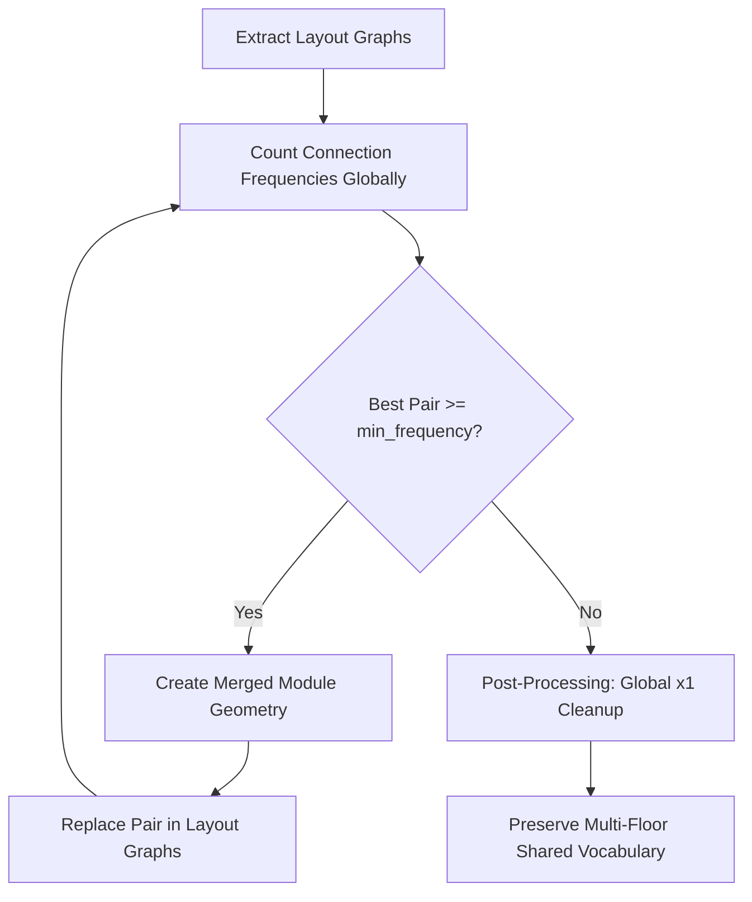

# BPE Layout Merging Algorithm: Developer Guide

This document provides a comprehensive reference on the layout merging algorithm, the core motivation and origins of this design choice, what we are trying to achieve, the history of attempts and resolved issues, and the mathematical/geometric constraints of **2D rotational symmetry**.

---

## 1. Origin, Motivation & Purpose: Why BPE?

### The Core Problem in Layout Generation
When training a reinforcement learning (RL) agent to generate architectural layouts, the agent operates in an environment where it places basic shapes (like single rooms, corridor segments, or cores) one-by-one. However, designing layouts using only basic, isolated shapes introduces several problems:
1. **Horizon Length / Action Space Explosion**: Placing 50 individual rooms to fill a floor requires a 50-step RL horizon. Long horizons make credit assignment extremely difficult for policy models, causing training to stall or fail.
2. **Lack of Modularity**: Modern constructible buildings rely on standardized modular systems (e.g., repeating apartments, double-room units, core-corridor modules). An agent placing single shapes has no built-in bias toward modular structure, leading to disjointed, custom geometries that are difficult to standardize.
3. **Overly Custom Assemblies**: Manually hardcoding pre-built modular shapes limits the agent's creativity and prevents standard shapes from naturally adapting to various site boundary shapes.

### How We Got to BPE (The Evolution of the Idea)
To solve these challenges, we needed a mechanism that allowed the agent to **discover its own modules** dynamically based on what it naturally builds. 
- *The Text Analogy*: We looked at Natural Language Processing (NLP). In NLP, text is parsed from individual characters into a subword vocabulary using **Byte Pair Encoding (BPE)**. 
- *Applying it to Geometry*: We mapped this translation to 2D floor layouts:
  - **Characters** $\rightarrow$ **Basic shapes** (single triangles, rectangles, quads).
  - **Subwords / Words** $\rightarrow$ **Merged composite shapes** (units, double-rooms, core-room links).
  - **Documents** $\rightarrow$ **Floor layout plans** generated by the agent during training episodes.
  - **Iterative Merges** $\rightarrow$ Finding the most frequently adjacent shapes in the layout and unioning their boundaries to form a new single shape in the dictionary.

### The Ultimate Point: What BPE Achieves
By running BPE dynamically during training, we achieve three major objectives:
- **Action Space Compression**: The agent can place a large, pre-merged composite module in a single step rather than taking 5-10 separate steps to build it. This shrinks the RL horizon, making the credit assignment gradient flow significantly cleaner and faster.
- **Visual Modularity**: Merged modules are rendered with shared boundary outlines, highlighting repeating modular assemblies across the floors.
- **Semantic Representation**: It raises the policy's reasoning from low-level geometry (placing lines/triangles) to high-level architectural units (placing functional units).

---

## 2. What We Are Trying to Achieve

In reinforcement learning layout design, the agent places standard basic shapes (such as squares, rectangles, triangles, and parallelograms) on a grid. To optimize architectural quality and structure:
1. **Discover Repeating Patterns**: If the agent frequently places two basic shapes next to each other in a specific configuration (e.g. two triangles forming a quad, or a room attached to a corridor), we want to identify this pair as a single composite module.
2. **Dynamic Vocabulary Growth**: We start with a basic shape dictionary and iteratively merge the most frequent adjacent pairs into new compound shapes.
3. **Reward Reused Merges**: The agent receives a bonus ($+3.0$ points per merge) for utilizing these compound modules, reinforcing modularity and layout reuse.
4. **Avoid One-Off Merges ($x1$ leftovers)**: If a compound shape is created but only appears once in the entire layout across all floors, it is a leftover/accidental merge. We want to dynamically dismantle it back to its basic shapes so it doesn't clutter the dictionary or receive rewards.

---

## 2. The Merging Pipeline (Step-by-Step)

The BPE merge process is executed at the end of an episode (or when paused) across all parallel environments (floors) in the building:



### Step 1: Layout Graph Extraction
Each placement is treated as a graph node. We look at every pair of adjacent shapes and check if their boundaries touch. If they share a port boundary (collinear segments with $\ge 90\%$ overlap), we add a `PortConnection` (graph edge) between them.

### Step 2: Canonical Pair Counting
We iterate over all connections across all floors and count their frequencies using a `MergePairKey`. Since shapes can be rotated, the connection key must be rotation-invariant (see Section 4).

### Step 3: Best Pair Selection
We rank connection keys by global frequency. The most frequent valid pair that passes the `min_frequency` threshold (typically $\ge 2$ across the entire building layout) is selected.

### Step 4: Geometric Union & Replacement
We compute the union of the two polygons using `merge_polygons_at_edge`. If the geometry union succeeds:
1. A new merged node is created in the graph.
2. The two parent nodes are deleted.
3. Neighboring connections are dynamically re-extracted for the remaining nodes in the graph.

### Step 5: Iteration
Steps 2 to 4 repeat for a fixed number of rounds (e.g. `max_rounds = 20`) or until no pairs meet the frequency threshold.

### Step 6: Post-Processing Cleanup
At the end of BPE, we count the final global frequencies of all merged shape types. If any merged type appears exactly once globally, we pop it from the graphs and restore its constituent basic shapes.

---

## 3. What We Have Tried (Historical Bugs & Resolutions)

When implementing and refining this pipeline, we encountered several critical bugs that you should be aware of when rewriting the algorithm:

### A. Coordinate Misalignment across Floors
* **The Bug**: When replacing a pair with a merged shape, the BPE algorithm originally copied the local constituent `components` list from the very first environment where it merged. Because local coordinate positions differ between floors, this caused components on subsequent floors to fly or rotate completely outside the site boundaries.
* **The Fix**: `replace_pair_with_merged` must dynamically extract and assign the **actual local component coordinates** of the two nodes being merged on that specific floor graph, preserving their correct floor offsets.

### B. Double-Precision Floating-Point Snapping (Holes & Disappearing Shapes)
* **The Bug**: Triangles or quads would sometimes completely disappear from the canvas after a merge, leaving white holes. This was caused by floating-point precision mismatches when adjacent shapes touch but their port coordinates are slightly shifted. When split-vertex insertion failed, BPE deleted both parents but failed to form the union polygon.
* **The Fix**: We introduced:
  1. Exact overlap segment matching (extracting the exact intersection bounds of the ports for insertion).
  2. Non-destructive BPE fallbacks (if geometry union returns `None`, BPE aborts that specific instance merge and keeps the parent nodes intact instead of deleting them).

### C. Category & Function Loss (Color Bleeding)
* **The Bug**: Merging a `Room` (green) and a `Core` (red) originally painted the entire unioned polygon green. This destroyed the distinct visual color-coding of space functions.
* **The Fix**: The backend returns the constituent `components` of the merged shape. The visualizer renders each component separately with its own function color and draws a thin inner boundary between them, while drawing a thick outer border around the unified BPE shape.

### D. Shape Type Extraction Failure (The Instance Index Trap)
* **The Bug**: Shapes in the layouts are generated with unique IDs (e.g. `s3-000`, `T_equi-001`). When BPE extracted the shape type, a naive string split fallback extracted the instance suffixes (`"000"`, `"001"`) as the shape type. This treated every instance as a unique shape type, splitting port counts and preventing BPE merges entirely.
* **The Fix**: We wrote a robust `get_node_shape_type(node)` parser that safely strips instance suffixes and extracts base shape types (e.g. `"s3"`, `"T_equi"`, `"Q_rect_S"`).

### E. Floor-Specific vs. Global Frequencies
* **The Bug**: A local check `local_counts[graph_idx] < 2` was added to prevent single-count merges per floor. However, this blocked shared multi-floor layout patterns (like three `s7` triangles in a row) that occurred exactly once per floor but multiple times across the building, leaving them unmerged.
* **The Fix**: We shifted BPE merge loop checks and final unmerging passes to check **global building-wide frequencies** instead of local floor frequencies.

---

## 4. 2D Rotational Symmetries & Port Canonicalization

To merge shapes regardless of how they are rotated on the canvas, the connection key must be rotation-invariant.

### How We Approached Rotational Symmetries (The Progression)
Solving rotational symmetries was a multi-stage process where we had to move from simple heuristics to robust geometric analysis:

1. **Phase 1: No Canonicalization (Severe Merge Failure)**
   * *Approach*: Originally, connections were counted strictly by their specific local edge indices (e.g., Node A Edge 1 connects to Node B Edge 0).
   * *Why it failed*: If two identical shapes met in the exact same physical configuration, but one assembly was rotated by $90^\circ$ relative to the grid, the edge indices swapped. BPE counted them as completely different connection keys, splitting the frequencies and preventing merges from passing the threshold.
   
2. **Phase 2: Hardcoded ID Checks (Fragile & Incomplete)**
   * *Approach*: We canonicalized edge indices by checking hardcoded shape ID strings (e.g., if `shape_type == "T_equi"` or `shape_type.startswith("Q_rect")`).
   * *Why it failed*: When environments used custom shape dictionaries (like `s3` for triangles and `s1` for quads), the string matching failed. The algorithm fell back to treating them as asymmetrical, blocking merges for those custom shapes.

3. **Phase 3: Coordinate-Free Geometric Checks (Final Robust Solution)**
   * *Approach*: We shifted from ID string checking to direct geometric inspection of the polygon's boundary. By counting the vertices and measuring the lengths of the edges of the shape, we dynamically identify whether a shape has rotational symmetry:
     - 3 vertices with equal sides $\rightarrow$ Equilateral Triangle (rotational symmetry across all 3 sides).
     - 4 vertices with opposite sides equal $\rightarrow$ Parallelogram or Rectangle (rotational symmetry of $180^\circ$ opposite sides).
   * *Why it succeeded*: This is 100% ID-agnostic. It correctly handles any shape format (both standard library shapes and custom procedural shapes) seamlessly.

### The Port Connection Key
A port connection between two nodes is defined as:
$$\text{PortConnection} = ( \text{port}_a \text{ of } A ) \longleftrightarrow ( \text{port}_b \text{ of } B )$$

To represent this port-to-port connection:
1. We sort the two nodes to ensure $A$ and $B$ are ordered consistently (e.g. by shape type ID).
2. We record the relative angle between the two nodes (snapped to multiples of $15^\circ$).
3. We represent each port as `(shape_type, edge_index, half)`.

### 2D Rigid Rotations vs. Reflections (Chirality)
Symmetry must respect the rules of **2D rigid rotations** (only rotating in the plane). Reflection (flipping the shape over) is not allowed because layout modules cannot be mirrored in a 2D floor plan.

```
       NO FLIPPING (Reflection)
          ▲
          │      Mirror
     ┌────┼────┐ ───────► ┌────┼────┐
     │ L  │  R │          │ R  │  L │
     └────┴────┘          └────┴────┘
       (Not achievable by 2D rotation)
```

#### 1. Equilateral Triangles ($120^\circ$ rotational symmetry)
* **Geometry**: All 3 edges are equal length. Rotating the triangle by $120^\circ$ or $240^\circ$ maps the shape onto itself.
* **Canonicalization**: Edges `0`, `1`, and `2` are indistinguishable. We map all edge indices to `0`. The segment half (`"L"` or `"R"`) is preserved.

#### 2. Parallelograms and Rectangles ($180^\circ$ rotational symmetry)
* **Geometry**: Opposite sides are equal length and parallel. Rotating by $180^\circ$ maps the shape onto itself.
* **Canonicalization**:
  * Edge `2` is opposite and symmetric to Edge `0`.
  * Edge `3` is opposite and symmetric to Edge `1`.
  * Because a $180^\circ$ rotation reverses the edge loop direction, the edge's half segment must be **flipped** (`"L" <-> "R"`):
    * Edge `2` maps to Edge `0` (with flipped half).
    * Edge `3` maps to Edge `1` (with flipped half).

#### 3. Chiral Shapes (No 2D Rotational Symmetry)
* **Right Isosceles Triangles** (e.g. `T_45`): Has two equal legs, but they meet at a right angle. You cannot map the bottom leg onto the vertical leg via 2D rigid rotation without mirroring the triangle.
* **Symmetric Trapezoids** (`Q_trap_sym`): Has two equal slanted sides, but they converge. You cannot map the left side onto the right side via 2D rotation without turning the trapezoid upside down, which changes the parallel bases alignment.
* **Canonicalization**: These edges must remain distinct. No edge index mapping is performed.

### Coordinate-Free Geometric Symmetry Check
To make your BPE code robust to any custom shape IDs (like `s3` instead of `T_equi`), evaluate the **geometry of the polygon** directly:

```python
def canonicalize_geometry_port(shape_type: str, edge_index: int, half: str, poly: list[dict]) -> tuple[int, str]:
    if not poly or len(poly) < 3:
        return edge_index, half
        
    n = len(poly)
    # 1. Compute side lengths
    lengths = []
    for i in range(n):
        p1 = poly[i]
        p2 = poly[(i + 1) % n]
        lengths.append(math.hypot(p2["x"] - p1["x"], p2["y"] - p1["y"]))
        
    # 2. Equilateral Triangles (3 equal sides)
    if n == 3:
        if abs(lengths[0] - lengths[1]) < 1e-2 and abs(lengths[1] - lengths[2]) < 1e-2:
            return 0, half
            
    # 3. Parallelograms / Rectangles (4 sides, opposite sides equal)
    elif n == 4:
        if abs(lengths[0] - lengths[2]) < 1e-2 and abs(lengths[1] - lengths[3]) < 1e-2:
            if edge_index == 2:
                flipped_half = "R" if half == "L" else "L"
                return 0, flipped_half
            elif edge_index == 3:
                flipped_half = "R" if half == "L" else "L"
                return 1, flipped_half
                
    return edge_index, half
```
