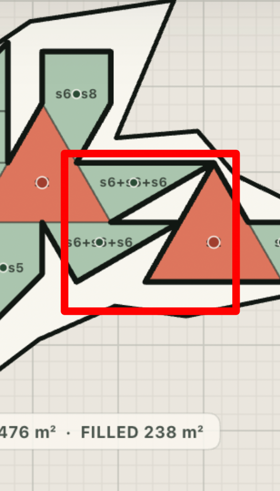
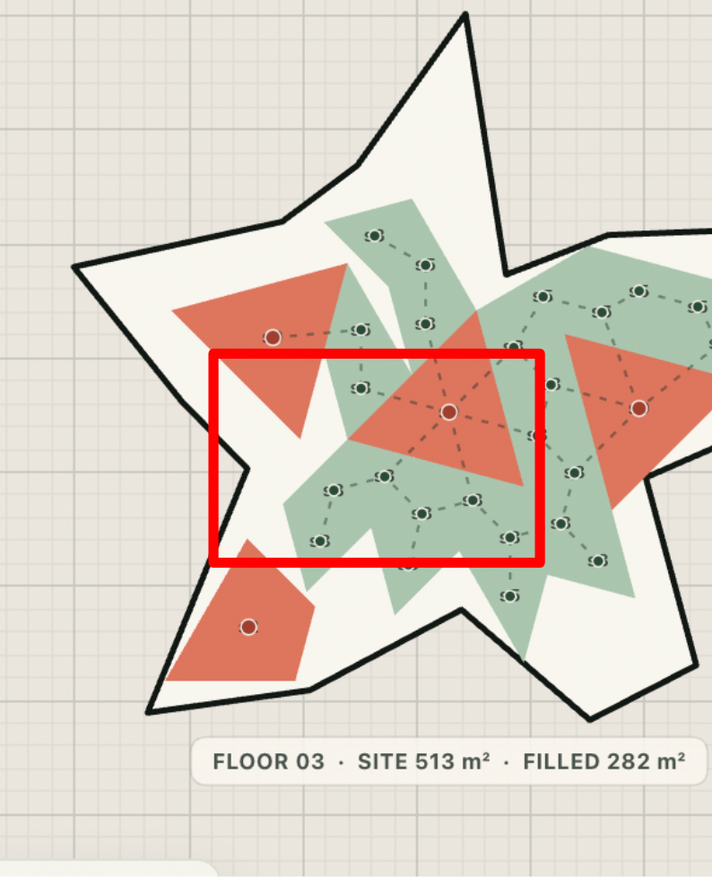
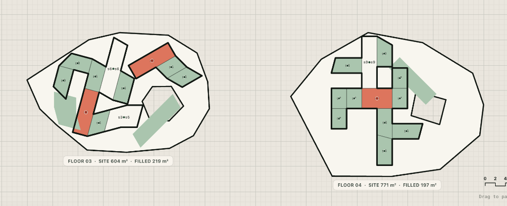

# Module Lab v0.5 - Issues Tracker

This document tracks all layout, geometric, and RL training issues. Solved issues remain logged for future reference.

---

## 1. Solved Issues


### Visualizer Rendering Crash on Cached HTML (HTML Cache Mismatch)
* **Status**: `Solved`
* **Description**:
  When the browser served a cached `index.html` (which lacked the new merging toggle button) along with the updated `app.js` (which registered an event listener on it), the script would encounter a `null` DOM reference and throw a `TypeError: Cannot read properties of null (reading 'addEventListener')`. This halted the entire JavaScript execution thread.
* **Resolution**:
  Wrapped the event listener registration in `setupActionEvents` in a null check block (`if (dom.toggleMergingBtn)`). This stops the TypeError crash and allows the script to initialize successfully even in the presence of browser cache mismatch.

---

### Space Bar Pause/Resume Double-Triggering
* **Status**: `Solved`
* **Description**:
  When the user paused or resumed training using the Space bar while a button (such as the Pause button itself) had keyboard focus, the browser fired its default Space-to-Click event in addition to the global keydown event. This caused `toggleTraining()` to be called twice in rapid succession, immediately undoing the action.
* **Resolution**:
  Added an early return in the global keydown handler to ignore Space bar events if the active element is a `<button>`, allowing the browser's default click handler to manage the event naturally without double-triggering.

---

### BPE Merged Shape Color Homogenization (Core Turning into Room After Merging)
* **Status**: `Solved`
* **Description**:
  When BPE merged adjacent modules of different categories (e.g., merging a `Core` and a `Room`), the client filled the entire merged shape contour with a single category color (typically green/room color), completely losing the distinct color-coded visual identity of the constituent spaces (red for core, green for room).
  
* **Screenshots**:
  ````carousel
  
  <!-- slide -->
  
  ````

* **Resolution**:
  Modified `drawPlacements(ctx)` in `app.js` to always fill and draw individual constituent components using their own specific category colors if `placement.components` is present. Because the wall cache handles removing interior walls when merging is active, the shapes look unified but preserve their distinct interior functions.

---

### Missing Merged Shapes Dictionary Display
* **Status**: `Solved`
* **Description**:
  When merging was enabled, the visualizer sidebar still rendered the basic unmerged shapes library in the dictionary panel. The BPE-merged composite shapes (like L-shapes or T-shapes) were not shown in the dictionary list, making it impossible to see the SVG geometries of BPE-merged modules.
* **Resolution**:
  Updated the websocket payload (in both `placements` and `episodeDone` events) in `server.py` to transmit the active BPE merged vocabulary (`mergedDictionary`). Updated `app.js` to store this dictionary and modified `updateDictionaryUI` to render the merged shape SVGs dynamically when merging is enabled (default), falling back to the base shapes list when merging is disabled (via key/button M).

---

### BPE Consecutive Merges Failure & Unmerged Adjacent Shapes (Edge-Index & Port Shift Mismatch)
* **Status**: `Partially Solved` (Geometric port canonicalization solved; frequency issues pending verification)
* **Description**:
  Even though shapes could be merged into larger sequences (such as multiple adjacent room triangles, or a merged `s3+s3` quadrilateral and a neighboring `s3` triangle), BPE would fail to detect the merge opportunity on some floors. This resulted in duplicate labels and thick outlines between touching shapes that should have been unified.
  
  This was caused by two main bugs:
  1. **Port Index Shift**: The connection port keys used `edge_index` of the merged polygon. Since BPE walks merged polygons dynamically, the edge order on a merged shape shifts across BPE rounds and environments. This caused BPE to count identical connections as different pairs, splitting their frequencies and preventing merges from hitting the `min_frequency = 2` threshold.
  2. **Short Port Overlap Segments**: Merging was performed on the port segment (which is only half of the shared edge). This left the other half of the shared edge in the merged polygon, creating self-intersecting loops and collinear artifacts that broke subsequent adjacency detection.

* **Screenshots**:
  ````carousel
  
  <!-- slide -->
  
  <!-- slide -->
  
  ````

* **Resolution (In Progress)**:
  1. **Constituent Port Canonicalization**: Implemented `canonicalize_port` in `graph.py` which maps any port on a merged shape back to its constituent basic shape's original edge index and half. This keeps port identifiers 100% stable across all rounds and playgrounds.
  2. **Symmetric Port Sorting**: Refined `canonicalize_pair` in `graph.py` to compare and sort port identifiers when node types are identical (`type_a == type_b`) to prevent duplicate keys.
  3. **Full Overlap Unioning**: Added `find_full_overlap_segment` to calculate the full shared boundary segment between two shapes and union them along that full segment, producing clean outer contours.
  4. **Strict Local Reused merges Rewards**: Modified the `bpe_bonus` formula in `server.py` to only count and reward merges where the merged shape is reused at least twice (`frequency >= 2`) on that specific floor, preventing global BPE merges that appear only once per floor from artificially inflating training scores.
  5. **BPE Vocab list Attribute Error**: Fixed an AttributeError (`step failed: 'list' object has no attribute 'get'`) in `server.py` by converting the returned `merged_vocab` list into a lookup dictionary using `vocab_dict = {module.type_id: module for module in merged_vocab}`.
  6. **Floor-Specific Merge Frequency Constraint**: Modified `bpe_merge` in `graph.py` to pre-count pair occurrences per environment graph. BPE now skips performing the merge on any floor layout where the pair occurs less than 2 times.
  7. **Post-Processing Unmerge for Leftovers**: Added a post-processing unmerge pass at the end of `bpe_merge` in `graph.py`. After all BPE rounds are completed, BPE inspects the final layout graphs and dynamically reverts (unmerges) any merged shape node that ends up appearing only once (`frequency < 2`) on that floor back to its constituent basic shapes. This guarantees that no BPE shape is ever created or kept in the layout if it has a frequency of 1 on that floor.

---

### Interactive Hover Highlights & Transition Delays
* **Status**: `Partially Solved` (Frequencies and mapping resolved; 1s linear transition implemented)
* **Description**:
  When hovering over procedural dictionary shapes, non-matching shapes on the canvas should smoothly dim out over exactly 1 second to prevent rapid flickering, and take exactly 1 second to go back when mouse leaves. Additionally, frequencies in the dictionary displayed as `x0` upon pausing the training until the user toggled the merging button twice, and complete BPE shapes were not highlighting.
  
  This was caused by three main bugs:
  1. **Update Sequencing Bug**: `handlePlacementsEvent` in `app.js` was calling `updateDictionaryUI` before calling `enterPausedState` (which clears and loads paused placements). This caused the initial pause render to count frequencies on old/empty lists, displaying `x0`.
  2. **Mismatching ID Formats**: `app.js` parsed raw placements using BPE-round types (e.g. `M_round0_1`), while `server.py` transmitted placements using component module IDs (e.g. `s1+s1`). The mismatch prevented matching hover lookups.
  3. **Instant Opacity Jump**: Opacity changes in the canvas viewport were applied instantly, which caused visual flickering when moving the mouse across cards.

* **Resolution (In Progress)**:
  1. **Corrected Event Sequencing**: Rearranged handlers in `app.js` to call `reloadPausedPlacements` before calling `updateDictionaryUI`, ensuring that paused placement frequencies are calculated correctly immediately.
  2. **Aligned IDs**: Updated `server.py` to prioritize `shapeType` (falling back to `moduleId` and `id`) when formatting placements and components. Merged placements now use `M_round0_s1_s1` matching the dictionary ID format.
  3. **Linear 1s Transition**: Added a linear transition in `app.js` that continuously updates `state.dimmingFactor` using the frame time delta (`dt`) over exactly 1.0 second when mouse hover enters or leaves, creating a clean, symmetrical 1s linear fade animation.
  4. **Dynamic Placements Toggling**: Updated `toggleMerging` in `app.js` to clear and reload the correct unmerged/merged placements list dynamically when BPE is toggled on pause.
  5. **Resuming Active Training Reset**: Reset `hoveredModuleId`, `lastHoveredModuleId`, and `dimmingFactor` immediately when training starts/resumes in `toggleTraining`, `beginNextEpisode`, and `handlePlacementsEvent` (when running). This ensures viewport shapes are fully visible and not blocked by active hover states during running steps.
  6. **Placement Accumulation Bug**: Replaced the overwrite of `state.individualPlacementsList` inside `handlePlacementsEvent` with `.push(...data.placements)` to accumulate placements throughout the episode. Because each step message only transmits the single new placement, appending is necessary to prevent earlier shapes from disappearing upon resuming. The lists are cleared explicitly inside `beginNextEpisode` at the start of a new episode.
  7. **Stale BPE Vocabulary and x0/x1 Card Filters**: Reset `state.mergedDictionary = []` at the start of each episode in `beginNextEpisode` to prevent stale BPE merged shape definitions from previous runs from persisting as `x0` or `x1` cards. Filtered `updateDictionaryUI` to only display BPE merged shape cards that have a local layout frequency of at least 2 (`count >= 2`), completely hiding leftover sub-modules or unused modules from the active sidebar view.
  8. **Active Score Breakdown Panel**: Added an expanding "Active Score Breakdown" panel inside the Simulation Controls sidebar. The panel activates when training is paused/stopped and details the precise points contributions of the 6 layout objectives, the base raw score, BPE merge bonuses, unmerged triangle penalties, and a detailed floor-by-floor breakdown of active reachability/topology violations.
  9. **Terminal Evaluation on Pause**: Implemented a read-only `evaluate` WebSocket command in `server.py` and routed it in `app.js`'s `enterPausedState()`. When the training is paused, the client immediately requests a complete terminal-like evaluation of the current placements layout. The server runs BPE, computes all 6 rewards, calculates the BPE merge bonus, unmerged triangle penalties, and detailed topology check violations, and returns the finished metrics so the user gets a complete breakdown of why their paused state scored what it did.
  10. **Infinite Evaluation Loop Fix**: Wrapped the `enterPausedState` call inside `handlePlacementsEvent` in `app.js` with `if (state.phase !== 'paused')`. This prevents the client from infinitely re-triggering the evaluation request when it receives the placements response from a previous pause evaluation, completely stopping the flickering and locking the UI to "resolving vector walls ready".

---

---

## 3. Unsolved Issues

### BPE Merge Polygon Disappearance & Hole Generation (Double-Precision Floating Point Snapping Failure)

* **Status**: `Proposed Fix Pending Verification` (Awaiting user verification of updated fix)
* **Description**:
  During BPE merges (both at the end of episodes and in real-time when pausing), certain rooms would completely disappear from the visualizer, causing the total `FILLED` area to drop (e.g., from $251\text{ m}^2$ to $238\text{ m}^2$, or in another run from $282\text{ m}^2$ to $268\text{ m}^2$). This resulted in visible white holes and missing modules.
  
  This was caused by floating-point coordinate discrepancies when adjacent modules touch but are slightly shifted (e.g., sharing 90% of the port edge). Because the port endpoints lay slightly outside the opposing module's boundary, split-vertex insertions failed, resulting in unmatched connection indexes. BPE would then delete the second node and fall back to using only the first node's polygon, causing the other shape to disappear.

* **Screenshots (Set 1 - Run A)**:

  ````carousel
  
  <!-- slide -->
  
  ````

* **Screenshots (Set 2 - Run B)**:

  ````carousel
  
  <!-- slide -->
  
  ````

* **Proposed Resolution (Implemented)**:
  We implemented a two-fold solution to fully resolve this:
  1. **Exact Overlap segment matching**: In `extract_layout_graph` of [graph.py](file:///Users/ruslan_faz/Desktop/Work/Thesis/rl_v0.5/graph.py), we calculate the exact intersection coordinates of the overlapping port segments and store it in `PortConnection`. We use this exact overlap segment for boundary insertions, completely eliminating coordinate shift discrepancies.
  2. **Non-destructive BPE fallbacks**: If `merge_polygons_at_edge` fails, it returns `None` instead of deleting the second shape. The BPE loop detects this, rolls back the merge for that specific instance, skips to the next candidate pair, and leaves the original nodes and polygons completely intact.
  
  This is designed to guarantee that the total filled area never shrinks during BPE merging. Awaiting verification under training conditions.

---

### Merged Module Color/Function Homogenization (Loss of Core/Room Distinctions)

* **Status**: `Proposed Fix Pending Verification` (Awaiting user verification of fix)
* **Description**:
  When BPE merged adjacent modules of different space functions (e.g. merging a `Room` and a `Core`), the visualizer changed the fill color of the entire merged block to a single category (typically green for Room). The distinct visual identity and color-coding of the spaces (red for core, green for room) was lost, even though their real-world functions remained separate.

* **Proposed Resolution (Implemented)**:
  We updated both the backend and frontend to support multi-functional merged shapes:
  1. **Constituent Component Tracking**: In `server.py` (both in `_finish_episode` and `step`), the formatted BPE merged placements now contain a list of their original translated constituent `components`, keeping each component's individual polygon, category, and ID.
  2. **Multi-Color Component Rendering**: In `app.js`, `upsertPlacement` parses this components list. The `drawPlacements` function has been updated to loop through and fill each constituent component's polygon with its own category color, and draw a thin outline along their internal "common boundaries". The thick outer outline is still drawn around the BPE merged shape's unified boundary, and the BPE merged label (e.g., `s8+s5`) is rendered at the shape's centroid.

---

### BPE Merge Algorithm Collision & Failure to Merge Symmetric Shapes

* **Status**: `Proposed Fix Pending Verification`
* **Description**:
  The BPE merge algorithm fails to correctly identify and merge adjacent shapes under rotational symmetry, resulting in two distinct issues:
  
  1. **Rotational Symmetry Collision**: When BPE merges two shapes, the type ID is generated as `M_round{round}_{type_a}_{type_b}`. If the same two shape types merge at different port connections (different edges or relative angles), they form completely different composite shapes. However, because they are assigned the same type ID, BPE treats them as the same vocabulary token. This causes different geometries to be incorrectly deemed the "same shape type" (e.g., sharing the same card or outline highlight despite having different relative coordinates).
  2. **Failure to Merge Triangles and Parallelograms**: Even though triangles (`s3`) and parallelograms have rotational symmetries (e.g., all 3 edges of equilateral triangles are identical, and opposite edges of parallelograms/rectangles are identical under 2D rigid rotations), the merge algorithm still fails to identify them as mergeable. Triangles and quads that share adjacent edges are left completely unmerged despite clear opportunities to form composite modules.

* **Proposed Resolution (Implemented)**:
  We implemented three major backend fixes in [graph.py](file:///Users/ruslan_faz/Desktop/Work/Thesis/rl_v0.5/graph.py) to resolve the merge failure issues:
  1. **BPE Shape Type Extraction Bug Fix**: Added `get_node_shape_type` in `graph.py` to correctly resolve shape type IDs (like `"s3"`, `"T_equi"`, `"Q_rect_S"`) from node `moduleId` properties. Previously, it fell back to extracting the unique instance suffix (`"000"`, `"001"`, etc.), which made BPE treat every single placement instance as a completely different shape type, preventing any merges.
  2. **Geometric Symmetry Port Canonicalization**: Refactored `canonicalize_geometry_port` to perform coordinate-free geometric symmetry checks. Equilateral triangles (3 equal sides, e.g. `s3`, `T_equi`) canonicalize all edges to `0`. Parallelograms/rectangles (4 sides with opposite sides equal, e.g. `s1`, `s5`, `Q_rect_S`) canonicalize opposite Edge 2 -> 0 and Edge 3 -> 1 (with flipped half segments), preventing counts from splitting across symmetric edges.
  3. **Global BPE Frequency Resolution**: Modified the merge loop and post-processing unmerge pass to count and check frequencies globally across all playground floor layout graphs combined, rather than locally per floor graph. This enables merging repeated multi-floor design patterns (like the three `s7` triangles) that happen once per floor.

---

### BPE Merged Shapes Floating/Rotated Offsets (Component Coordinate Misalignment)

* **Status**: `Proposed Fix Pending Verification` (Awaiting user verification of fix)
* **Description**:
  When training was paused, constituent BPE components on some floors (like Floor 03 and Floor 04) were rendered offset, floating, or rotated outside the site boundary.
  
  This was caused because `replace_pair_with_merged` in [graph.py](file:///Users/ruslan_faz/Desktop/Work/Thesis/rl_v0.5/graph.py) assigned the `components` list of the **first encountered merged instance** (e.g. from Floor 01) to the BPE node across **all other floors/playgrounds** (`"components": merged.components`). As a result, components on other floors copied Floor 01's local coordinates, which, when translated by those floors' environment offsets, appeared flying/rotated in incorrect world positions.

* **Screenshots**:

  ````carousel
  
  ````

* **Proposed Resolution (Implemented)**:
  We updated `replace_pair_with_merged` in `graph.py` to dynamically collect and assign the **actual local components** (`local_components`) of the two merging nodes on that specific floor's graph, instead of reusing the first instance's components. This guarantees that all component polygons preserve their correct local and world coordinates relative to their own floor layout.

---

## 4. Emerges as a Result of Other Solution (Regressive Side Effects)

### Visualizer Rendering Crash (Side Effect of Component Color Preservation)

* **Status**: `Proposed Fix Pending Verification` (Awaiting user verification of fix)
* **Description**:
  When introducing the constituent component coloring fix in [app.js](file:///Users/ruslan_faz/Desktop/Work/Thesis/rl_v0.5/app.js), the definitions of five critical local variables (`module`, `category`, `area`, `center`, and `bounds`) inside `upsertPlacement` were accidentally deleted during code replacement. 
  
  This caused `upsertPlacement` to crash with a `ReferenceError: bounds is not defined` as soon as it processed the first placement. As a result, the entire visualizer rendering pipeline failed silently, and no shapes or modules were drawn on the canvas, leaving only the boundary shapes visible.

* **Proposed Resolution (Implemented)**:
  We restored the deleted variable definitions in `upsertPlacement` inside `app.js`.

---

### Unscaled Unmerged Triangle Penalty (Side Effect of Triangle Penalty)

* **Status**: `Proposed Fix Pending Verification` (Awaiting user verification of fix)
* **Description**:
  When we introduced the penalty for unmerged triangles, the penalty was calculated as the **sum** of unmerged triangles across all parallel environments (`8.0 * unmerged_triangles`), but was subtracted directly from the final layout score, which is scaled as the **average** score per environment (0–100 scale). 
  
  When running with multiple parallel floors (e.g. 4 floors), placing even 2 unmerged triangles per floor resulted in a total penalty of $64.0$ points. This massive penalty dragged the training score straight to `0.0` in the early episodes and stalled the policy model's training because the advantage gradients were zeroed out.

* **Proposed Resolution (Implemented)**:
  We modified `_finish_episode` in [server.py](file:///Users/ruslan_faz/Desktop/Work/Thesis/rl_v0.5/server.py) to scale the penalty per floor:
  `average_unmerged_triangles = unmerged_triangles / len(layout_graphs)`
  `unmerged_triangle_penalty = 8.0 * average_unmerged_triangles`
