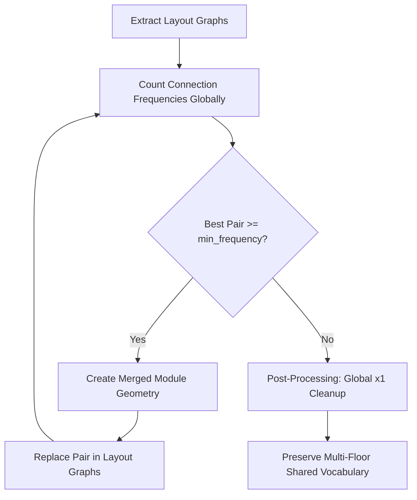

# BPE Layout Merging Algorithm: Developer Guide

This document provides a comprehensive reference on the layout merging algorithm, the core motivation and origins of this design choice, what we are trying to achieve, the history of attempts and resolved issues, the mathematical/geometric constraints of **2D rotational symmetry**, and guidelines for future development.

---

## 1. Origin, Motivation & Purpose: Why BPE?

### The Core Problem in Layout Generation
When training a reinforcement learning (RL) agent to generate architectural layouts, the agent operates in an environment where it places basic shapes (like single rooms, corridor segments, or cores) one-by-one. However, designing layouts using only basic, isolated shapes introduces several problems:
1. **Horizon Length / Action Space Explosion**: Placing 50 individual rooms to fill a floor requires a 50-step RL horizon. Long horizons make credit assignment extremely difficult for policy models, causing training to stall or fail.
2. **Lack of Modularity**: Modern constructible buildings rely on standardized modular systems (e.g., repeating apartments, double-room units, core-corridor modules). An agent placing single shapes has no built-in bias toward modular structure, leading to disjointed, custom geometries that are difficult to standardize.
3. **Overly Custom Assemblies**: Manually hardcoding pre-built modular shapes limits the agent's creativity and prevents standard shapes from naturally adapting to various site boundary shapes.

### How We Got to BPE (The Evolution of the Idea)
To solve these challenges, we needed a mechanism that allowed the agent to **discover its own modules** dynamically based on what it naturally builds. 
* *The Text Analogy*: We looked at Natural Language Processing (NLP). In NLP, text is parsed from individual characters into a subword vocabulary using **Byte Pair Encoding (BPE)**. 
* *Applying it to Geometry*: We mapped this translation to 2D floor layouts:
  - **Characters** $\rightarrow$ **Basic shapes** (single triangles, rectangles, quads).
  - **Subwords / Words** $\rightarrow$ **Merged composite shapes** (units, double-rooms, core-room links).
  - **Documents** $\rightarrow$ **Floor layout plans** generated by the agent during training episodes.
  - **Iterative Merges** $\rightarrow$ Finding the most frequently adjacent shapes in the layout and unioning their boundaries to form a new single shape in the dictionary.

---

## 2. The 3 Main Purposes of the BPE Merging Algorithm

In reinforcement learning layout design, the agent places standard basic shapes on a grid. To optimize architectural quality and structure, the BPE merging algorithm targets three objectives:

### I. Prefabrication Modularity & Standardization (Complexity Reduction)
* **Objective**: Discover repeating modular templates (such as core clusters, bathroom assemblies, or standard rooms) instead of treating every layout fragment as a unique shape.
* **Mechanism**: Just like sub-words merge into standardized words in NLP, BPE iteratively merges simple shapes into larger composite assemblies. This reduces the part count and standardizes joint layouts.

### II. Triangle & Small Shape Penalty Mitigation (Reward Optimization)
* **Objective**: Raw triangles and tiny shapes create sharp, unusable angles and are heavily penalized in the reward structure (`-8.0` points per unmerged triangle, averaged across floors).
* **Mechanism**: When adjacent small shapes are merged into larger composite polygons, they dissolve into the interior of those polygons. This removes them from the unmerged shape lists, neutralizing the penalty and allowing the layouts to achieve high positive scores.

### III. Dictionary Compression & Repetitive Pattern Learning
* **Objective**: Prevent the module dictionary from ballooning and exceeding the environment's hard dictionary capacity limits.
* **Mechanism**: 
  * As composite shapes are formed, they should "consume" the base shapes they are composed of. If base shapes are rarely left raw and are instead always merged, the active vocabulary size stays small.
  * A penalty is applied to layout scores if the shapes dictionary grows too large. 
  * We want the RL policy to learn **pattern-like, repetitive placement strategies**. When the policy repeats structured patterns, BPE consistently merges the shapes into the *same* small set of composite modular types, achieving massive dictionary compression.

---

## 3. The Merging Pipeline (Step-by-Step)

The BPE merge process is executed at the end of an episode (or when paused) across all parallel environments (floors) in the building:



* **Step 1: Layout Graph Extraction**: Each placement is treated as a graph node. We look at every pair of adjacent shapes and check if their boundaries touch. If they share a port boundary (collinear segments with $\ge 90\%$ overlap), we add a `PortConnection` (graph edge) between them.
* **Step 2: Canonical Pair Counting**: We iterate over all connections across all floors and count their frequencies using a `MergePairKey`. Since shapes can be rotated, the connection key must be rotation-invariant (see Section 5).
* **Step 3: Best Pair Selection**: We rank connection keys by global frequency. The most frequent valid pair that passes the `min_frequency` threshold (typically $\ge 2$ across the entire building layout) is selected.
* **Step 4: Geometric Union & Replacement**: We compute the union of the two polygons using `merge_polygons_at_edge`. If the geometry union succeeds:
  1. A new merged node is created in the graph.
  2. The two parent nodes are deleted.
  3. Neighboring connections are dynamically re-extracted for the remaining nodes in the graph.
* **Step 5: Iteration**: Steps 2 to 4 repeat for a fixed number of rounds (e.g. `max_rounds = 20`) or until no pairs meet the frequency threshold.
* **Step 6: Post-Processing Cleanup**: At the end of BPE, we count the final global frequencies of all merged shape types. If any merged type appears exactly once globally, we pop it from the graphs and restore its constituent basic shapes (dismantling leftover or accidental one-off merges).

---

## 4. What We Have Tried (Historical Bugs & Resolutions)

When implementing and refining this pipeline, we encountered several critical bugs that you should be aware of when modifying the algorithm:

### A. Coordinate Misalignment across Floors
* **The Bug**: When replacing a pair with a merged shape, the BPE algorithm originally copied the local constituent `components` list from the very first environment where it merged. Because local coordinate positions differ between floors, this caused components on subsequent floors to fly or rotate completely outside the site boundaries.
* **The Fix**: `replace_pair_with_merged` must dynamically extract and assign the **actual local component coordinates** of the two nodes being merged on that specific floor graph, preserving their correct floor offsets.

### B. Double-Precision Floating-Point Snapping (Holes & Disappearing Shapes)
* **The Bug**: Triangles or quads would sometimes completely disappear from the canvas after a merge, leaving white holes. This was caused by floating-point precision mismatches when adjacent shapes touch but their port coordinates are slightly shifted. When split-vertex insertion failed, BPE deleted both parents but failed to form the union polygon.
* **The Fix**: We rewrote `merge_polygons_at_edge` to use a robust boundary-segment-splitting algorithm:
  1. Splitting all directed edges of both polygons at all mutual projection vertices.
  2. Classifying each sub-segment as either exposed or shared.
  3. Discarding all shared segments and chaining remaining exposed segments end-to-end to reconstruct the perfect outer loop.

### C. Category & Function Loss (Color Bleeding)
* **The Bug**: Merging a `Room` (green) and a `Core` (red) originally painted the entire unioned polygon green. This destroyed the distinct visual color-coding of space functions.
* **The Fix**: The backend returns the constituent `components` of the merged shape. The visualizer renders each component separately with its own function color and draws a thin inner boundary between them, while drawing a thick outer border around the unified BPE shape.

### D. Shape Type Extraction Failure (The Instance Index Trap)
* **The Bug**: Shapes in the layouts are generated with unique IDs (e.g. `s3-000`, `T_equi-001`). When BPE extracted the shape type, a naive string split fallback extracted the instance suffixes (`"000"`, `"001"`) as the shape type. This treated every instance as a unique shape type, splitting port counts and preventing BPE merges entirely.
* **The Fix**: We wrote a robust `get_node_shape_type(node)` parser that safely strips instance suffixes and extracts base shape types (e.g. `"s3"`, `"T_equi"`, `"Q_rect_S"`).

### E. Floor-Specific vs. Global Frequencies
* **The Bug**: A local check `local_counts[graph_idx] < 2` was added to prevent single-count merges per floor. However, this blocked shared multi-floor layout patterns (like three `s7` triangles in a row) that occurred exactly once per floor but multiple times across the building, leaving them unmerged.
* **The Fix**: We shifted BPE merge loop checks and final unmerging passes to check **global building-wide frequencies** instead of local floor frequencies.

---

## 5. 2D Rotational Symmetries & Port Canonicalization

To merge shapes regardless of how they are rotated on the canvas, the connection key must be rotation-invariant.

### 2D Rigid Rotations vs. Reflections (Chirality)
Symmetry must respect the rules of **2D rigid rotations** (only rotating in the plane). Reflection (flipping the shape over) is not allowed because layout modules cannot be mirrored in a 2D floor plan.

```
       NO FLIPPING (Reflection)
          ▲
          │      Mirror
     ┌────┼────┐ ───────► ┌────┼────┐
     │ L  │  R │          │ R  │  L │
     └────┴────┘          └────┴────┘
       (Not achievable by 2D rotation)
```

### Geometric Symmetry Classification

#### 1. Equilateral Triangles ($120^\circ$ rotational symmetry)
* **Geometry**: All 3 edges are equal length. Rotating the triangle by $120^\circ$ or $240^\circ$ maps the shape onto itself.
* **Canonicalization**: Edges `0`, `1`, and `2` are indistinguishable. We map all edge indices to `0`. The segment half (`"L"` or `"R"`) is preserved.

#### 2. Squares / Regular Quads ($90^\circ$ rotational symmetry)
* **Geometry**: 4 vertices with all 4 edges of equal length meeting at $90^\circ$ angles.
* **Canonicalization**: All 4 edges are identical. We map all edge indices (`0`, `1`, `2`, `3`) to `0` under full rotational symmetry.

#### 3. Rhombuses (Full Rotational Symmetry)
* **Geometry**: 4 vertices with all 4 edges of equal length. 
* **Canonicalization**: Because all 4 sides are identical in length, they canonicalize to a single base index (`edge 0`) under full symmetry.

#### 4. Parallelograms and Rectangles (Pairwise Rotational Symmetry)
* **Geometry**: Opposite sides are equal length and parallel. Rotating by $180^\circ$ maps the shape onto itself.
* **Canonicalization**: Opposite edges are symmetric and direction-reversed:
  * Edge `2` maps to Edge `0` (with flipped half, e.g. `"L" <-> "R"`).
  * Edge `3` maps to Edge `1` (with flipped half, e.g. `"L" <-> "R"`).

#### 5. Chiral Shapes (No 2D Rotational Symmetry)
* **Right Isosceles Triangles** (e.g. `T_45`): Has two equal legs, but they meet at a right angle. You cannot map the bottom leg onto the vertical leg via 2D rigid rotation without mirroring.
* **Symmetric Trapezoids** (`Q_trap_sym`): Has two equal slanted sides, but they converge. You cannot map the left side onto the right side via 2D rotation.
* **Canonicalization**: These edges must remain distinct. No edge index mapping is performed.

---

## 6. Directions for Future Agents

To solve current BPE merge misses, future models should investigate:
1. **Symmetrical Angle Canonicalization**: Ensure that supplementary relative angles (like $60^\circ$ and $300^\circ$) map to a single representation in the BPE loop.
2. **Global Graph Beam Search / Rollouts**: Run multiple rollout passes over the graph to find global minimums for unmerged shapes, escaping greedy local bottlenecks.
3. **Deep (Triplet) Merging**: Support direct 3-shape merges (triplets) in a single BPE step to unify complex rooms or circulation clusters simultaneously.
